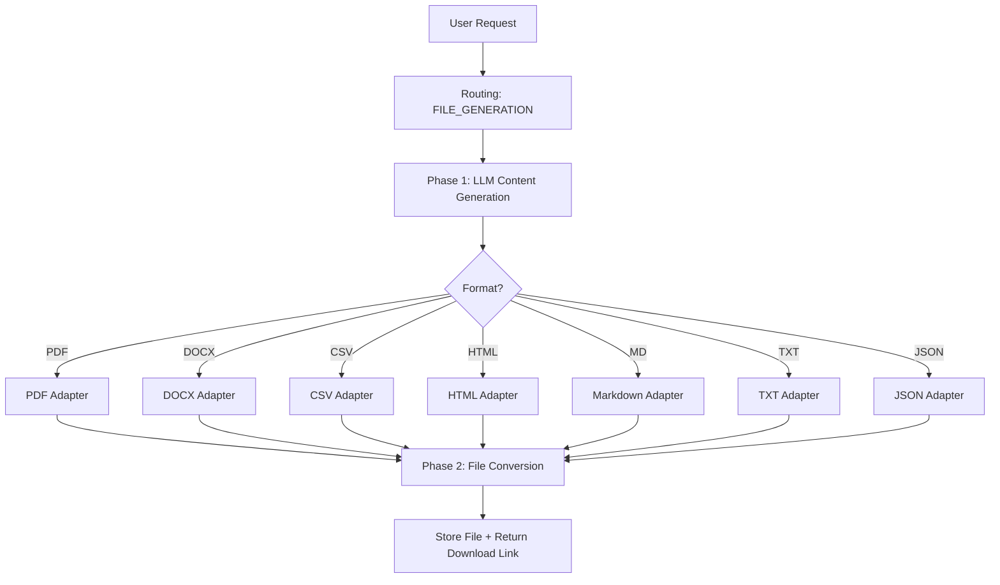

# File Generation Product Specification

## Overview

ClawAI can generate downloadable files in 7 formats from natural language requests. The system uses a two-phase approach: Phase 1 uses an LLM to generate the content, Phase 2 uses a format-specific adapter to convert the content into the requested file format.

---

## Supported Formats

| Format | Extension | Adapter | Use Case |
| --- | --- | --- | --- |
| PDF | .pdf | `pdf.adapter.ts` | Reports, documents, formal output |
| DOCX | .docx | `docx.adapter.ts` | Word documents, editable reports |
| CSV | .csv | `csv.adapter.ts` | Data exports, spreadsheets |
| HTML | .html | `html.adapter.ts` | Web-ready documents, rich formatting |
| Markdown | .md | `md.adapter.ts` | Technical documentation, READMEs |
| Plain Text | .txt | `txt.adapter.ts` | Simple text output, logs |
| JSON | .json | `json.adapter.ts` | Structured data, API responses |

---

## User Experience

### Generating a File

1. User sends a message like "Generate a CSV report of quarterly sales data"
2. Routing engine detects file generation intent via verb + format keyword matching
3. Routes to FILE_GENERATION provider
4. LLM generates structured content appropriate for the format
5. Format adapter converts content to the requested file format
6. File is stored and download link is returned in the chat response
7. User clicks to download the generated file

### Intent Detection

The routing engine detects file generation requests using regex-based matching:

**Action Verbs**: `generate`, `create`, `make`, `write`, `export`, `save`, `output`, `produce`, `build`

**Format Keywords**: `file`, `pdf`, `document`, `csv`, `docx`, `word`, `txt`, `text file`, `markdown`, `json`, `html`, `report`, `.md`, `.pdf`, `.csv`, `.docx`, `.txt`, `.json`, `.html`

**Exact Phrases** (high confidence): `export as`, `export to`, `save as`, `download as`, `save to file`, `write to file`, `output as file`

Examples that trigger file generation:
- "Generate a PDF report of the analysis"
- "Create a CSV with user data"
- "Export this as a markdown document"
- "Save the results to a JSON file"
- "Write a text file with the meeting notes"

---

## Two-Phase Architecture



### Phase 1: Content Generation

- An LLM (cloud or local, based on routing) generates the content
- For CSV: generates structured tabular data
- For JSON: generates valid JSON structure
- For PDF/DOCX: generates formatted text with sections and headings
- For Markdown/HTML: generates markup-ready content
- For TXT: generates plain text

### Phase 2: Format Conversion

Each format adapter takes the LLM-generated content and converts it:

- **PDF**: Uses a PDF generation library to produce formatted PDF
- **DOCX**: Builds a Word document with paragraphs and formatting
- **CSV**: Parses tabular data into proper CSV with headers
- **HTML**: Wraps content in a complete HTML document with styling
- **Markdown**: Ensures proper Markdown syntax
- **TXT**: Clean plain text output
- **JSON**: Validates and formats JSON

---

## Data Model

```
FileGenerationJob:
  id:           UUID
  userId:       UUID
  prompt:       String
  format:       Enum (PDF, DOCX, CSV, HTML, MD, TXT, JSON)
  status:       PENDING | IN_PROGRESS | COMPLETED | FAILED
  filePath:     String?
  fileName:     String?
  sizeBytes:    BigInt?
  error:        String?
  provider:     String
  model:        String
  createdAt:    DateTime
  updatedAt:    DateTime
```

---

## API Endpoints

| Endpoint | Method | Description |
| --- | --- | --- |
| `/api/v1/file-generations` | POST | Create a file generation request |
| `/api/v1/file-generations` | GET | List user's file generations (paginated) |
| `/api/v1/file-generations/:id` | GET | Get generation details and download link |
| `/api/v1/file-generations/:id/download` | GET | Download the generated file |

---

## Events

| Event | Publisher | Consumers |
| --- | --- | --- |
| `file.generated` | file-gen-service | audit-service |
| `file_generation.failed` | file-gen-service | audit-service |

---

## Error Handling

| Error | Cause | Resolution |
| --- | --- | --- |
| LLM content generation fails | Provider error | Fallback to alternate provider |
| Format conversion fails | Invalid content structure | Error message to user, suggest different format |
| File too large | Generated content exceeds limits | Truncation or split suggestion |

---

## Status: Beta

The file generation service is functional with all 7 format adapters implemented. Areas being refined:
- PDF formatting quality
- DOCX template support
- CSV header detection accuracy
- Error messaging for malformed LLM output
