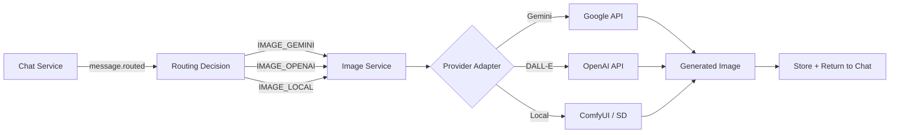

# Image Generation Product Specification

## Overview

ClawAI supports AI image generation through three providers: OpenAI DALL-E 3, Google Gemini 2.5 Flash Image, and local Stable Diffusion via ComfyUI. Users can generate images from text prompts within chat threads, generate variations from reference images, and manage their generation history.

---

## Supported Providers

| Provider | Model | Quality | Cost | Privacy |
| --- | --- | --- | --- | --- |
| OpenAI | DALL-E 3 | High (photorealistic) | Paid | Cloud |
| Google | Gemini 2.5 Flash Image | High (versatile) | Paid | Cloud |
| Local (ComfyUI) | SDXL-Turbo, FLUX, SD 3.5 | Medium | Free | Local |

---

## User Experience

### Text-to-Image Generation

1. User types a prompt in chat: "Generate an image of a futuristic city skyline at sunset"
2. AUTO routing detects image intent (90+ keyword patterns)
3. Routes to the default image provider (Gemini 2.5 Flash Image)
4. "Generating image..." indicator appears
5. Generated image appears in the message thread
6. Metadata shows: provider, model, dimensions, generation time

### Reference Image Generation

1. User uploads a reference image via file attachment
2. User types: "Generate a variation of this image in watercolor style"
3. System detects reference-based image generation intent
4. Reference image is sent along with the text prompt to the image provider
5. Generated variation appears in the thread

### Retry and Alternate

- **Retry**: Regenerate with the same prompt and provider
- **Try Alternate**: Use a different image model (e.g., switch from Gemini to DALL-E)

---

## Image Intent Detection

The routing engine uses 90+ keywords to detect image generation requests:

### Direct Creation Phrases
`generate an image`, `create a picture`, `draw me`, `make an image`, `design a logo`, `sketch`, `illustration of`, `paint me`, `photo of`, `render an image`, `visualize`, `depict`

### Reference-Based Phrases
`generate similar`, `similar to this`, `like this image`, `recreate this`, `reproduce this`, `variation of this`, `based on this image`, `inspired by this`, `generate from this`, `create similar`

### Scene/Location Prompts
`fantasy map`, `travel poster`, `floor plan`, `book cover`, `album cover`, `movie poster`, `game character`, `profile picture`, `social media post`, `app icon`

### Single-Word Strong Indicators
`render`, `photo`, `portrait`, `illustration`, `poster`, `sticker`, `logo`, `banner`, `mascot`

---

## Architecture



### Image Service Components

- **Controller**: Receives generation requests, returns results
- **Service**: Orchestrates generation, manages history
- **Adapters** (3): Provider-specific API adapters
  - `gemini-image.adapter.ts` - Google Gemini image generation
  - `openai-image.adapter.ts` - OpenAI DALL-E 3 generation
  - `stable-diffusion.adapter.ts` - Local ComfyUI/SD generation
- **Repository**: Image job and result persistence

### Data Model

```
ImageJob:
  id:           UUID
  userId:       UUID
  prompt:       String
  provider:     String
  model:        String
  status:       PENDING | IN_PROGRESS | COMPLETED | FAILED
  imageUrl:     String?
  dimensions:   String?
  error:        String?
  referenceId:  UUID?     (attached reference image)
  createdAt:    DateTime
  updatedAt:    DateTime
```

---

## Events

| Event | Publisher | Consumers | Payload |
| --- | --- | --- | --- |
| `image.generated` | image-service | audit-service | jobId, userId, provider, model, prompt |
| `image.failed` | image-service | audit-service | jobId, userId, provider, error |

---

## Error Handling

| Error | Cause | User Experience |
| --- | --- | --- |
| Provider timeout | Cloud API slow/down | Retry offered, alternate provider suggested |
| UNSUPPORTED_IMAGE_PROVIDER | Selected provider lacks image support | Error message, suggest switching provider |
| Content policy violation | Provider rejects prompt | Error message explaining content policy |
| Local SD unavailable | ComfyUI not running | Fallback to cloud provider or error message |

---

## Configuration

| Environment Variable | Default | Description |
| --- | --- | --- |
| `STABLE_DIFFUSION_URL` | -- | URL for local Stable Diffusion / ComfyUI |
| `IMAGE_SERVICE_URL` | `http://image-service:4012` | Internal service URL |
| `IMAGE_PORT` | `4012` | Image service port |
| `COMFYUI_BASE_URL` | -- | ComfyUI API endpoint |
| `COMFYUI_PORT` | -- | ComfyUI port |
