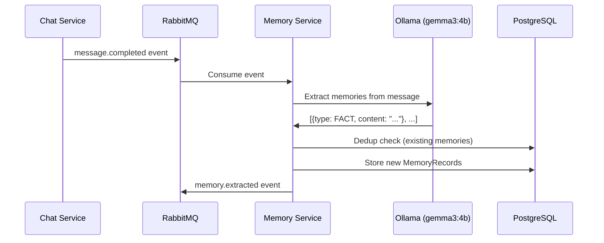

# Memory System Product Specification

## Overview

ClawAI's memory system automatically extracts key information from conversations and makes it available in future interactions. This creates a persistent knowledge layer that improves AI responses over time. The system also supports manually curated context packs -- collections of knowledge that can be attached to any thread.

---

## Core Concepts

### Memory Types

| Type | Description | Example |
| --- | --- | --- |
| FACT | Objective information about the user or their work | "User works on a NestJS microservices platform" |
| PREFERENCE | User's stated preferences for AI behavior | "User prefers TypeScript code examples" |
| INSTRUCTION | Explicit directives for AI interactions | "Always include error handling in code samples" |
| SUMMARY | Condensed summaries of conversation topics | "Discussed database migration strategy for PostgreSQL" |

### Context Packs

Curated collections of text items and file references that provide structured background knowledge. Unlike memories (which are auto-extracted), context packs are intentionally created and organized.

---

## Automatic Memory Extraction



### Extraction Process

1. **Trigger**: `message.completed` event arrives via RabbitMQ (async, non-blocking)
2. **Input**: Both the user's message and the AI's response
3. **Model**: Ollama extraction model (default: gemma3:4b, configurable via `MEMORY_EXTRACTION_MODEL`)
4. **Output**: Zod-validated array of extracted memories with type and content
5. **Deduplication**: Each extracted memory is compared against existing user memories to prevent duplicates
6. **Storage**: New, non-duplicate memories are persisted with source thread and message provenance

### Deduplication

Before storing a new memory, the system checks for semantic similarity against existing memories for the same user. This prevents accumulation of redundant facts like:
- "User prefers TypeScript" (already stored)
- "User likes TypeScript for coding" (duplicate, skipped)

---

## Memory CRUD Operations

### List Memories

- Paginated list of all user's memories
- Filter by type (FACT, PREFERENCE, INSTRUCTION, SUMMARY)
- Shows: content, type badge, source thread, enabled/disabled status, timestamp
- User-scoped: each user only sees their own memories

### Create Memory (Manual)

Users can manually create memories when they want to explicitly tell the AI something:
- Select type (FACT, PREFERENCE, INSTRUCTION, SUMMARY)
- Enter content (1-50,000 characters)
- Memory is immediately available for future context assembly

### Update Memory

Edit the content of an existing memory. Useful for correcting inaccurate extractions.

### Enable/Disable Memory

Toggle individual memories without deleting them:
- **Enabled**: Included in context assembly for all future messages
- **Disabled**: Excluded from context assembly but retained in the database

### Delete Memory

Permanently remove a memory from the system.

---

## Context Packs

### Creating a Context Pack

1. Navigate to Context Packs page
2. Click "Create Pack"
3. Enter name and description
4. Add items:
   - **Text items**: Free-form text content (business rules, coding standards, domain knowledge)
   - **File references**: Link to uploaded files
5. Order items by drag-and-drop (sorted by `sortOrder`)

### Attaching to a Thread

1. Open thread settings
2. Select context packs from the selector (up to 10 per thread)
3. All items from selected packs are included in every message's context assembly

### Use Cases

| Pack Name | Contents | Who Creates |
| --- | --- | --- |
| "Project Architecture" | Architecture decisions, tech stack, coding patterns | Developer |
| "Legal Standards" | Citation format, confidentiality rules, compliance requirements | Compliance officer |
| "Data Dictionary" | Business metrics definitions, KPI formulas, data source descriptions | Analyst |
| "Onboarding Guide" | Company policies, team structure, tool access | Team lead |

---

## Context Assembly Integration

When a user sends a message, the context assembly manager includes memories and context pack items in the prompt:

```
[System Prompt]          <- Thread-specific persona
[Memories]               <- Up to 20 enabled user memories
[Context Pack Items]     <- All items from attached packs (sorted by sortOrder)
[File Chunks]            <- Attached file content
[Thread History]         <- Previous messages
[Current User Message]   <- The new message
```

### Token Budget

- Memories are included after the system prompt and before file chunks
- If the total context exceeds the token budget, thread history is truncated from the tail
- System prompt, memories, and the current message are preserved (head-priority)

---

## Data Model

### MemoryRecord (PostgreSQL + pgvector)

```
id:              UUID
userId:          UUID
type:            Enum (FACT, PREFERENCE, INSTRUCTION, SUMMARY)
content:         String
sourceThreadId:  UUID?
sourceMessageId: UUID?
isEnabled:       Boolean (default: true)
createdAt:       DateTime
updatedAt:       DateTime
```

### ContextPack

```
id:              UUID
userId:          UUID
name:            String
description:     String?
scope:           String?
createdAt:       DateTime
updatedAt:       DateTime
```

### ContextPackItem

```
id:              UUID
contextPackId:   UUID
type:            Enum (TEXT, FILE)
content:         String?
fileId:          UUID?
sortOrder:       Int
createdAt:       DateTime
```

---

## API Endpoints

### Memories

| Endpoint | Method | Description |
| --- | --- | --- |
| `/api/v1/memories` | GET | List user's memories (paginated, filterable) |
| `/api/v1/memories` | POST | Create a manual memory |
| `/api/v1/memories/:id` | GET | Get memory details |
| `/api/v1/memories/:id` | PATCH | Update memory content or status |
| `/api/v1/memories/:id` | DELETE | Delete memory permanently |

### Context Packs

| Endpoint | Method | Description |
| --- | --- | --- |
| `/api/v1/context-packs` | GET | List user's context packs |
| `/api/v1/context-packs` | POST | Create a new context pack |
| `/api/v1/context-packs/:id` | GET | Get pack with items |
| `/api/v1/context-packs/:id` | PATCH | Update pack name/description |
| `/api/v1/context-packs/:id` | DELETE | Delete pack and items |

---

## Events

| Event | Publisher | Consumers |
| --- | --- | --- |
| `message.completed` | chat-service | memory-service (triggers extraction) |
| `memory.extracted` | memory-service | audit-service |

---

## Privacy Considerations

- Memories are strictly user-scoped (each user only sees and uses their own)
- Users can disable or delete sensitive memories at any time
- Memory extraction happens asynchronously -- it does not affect message delivery
- In LOCAL_ONLY mode, memory extraction uses the local Ollama model (no cloud)
- The memory page provides a clear audit of everything the system has stored
