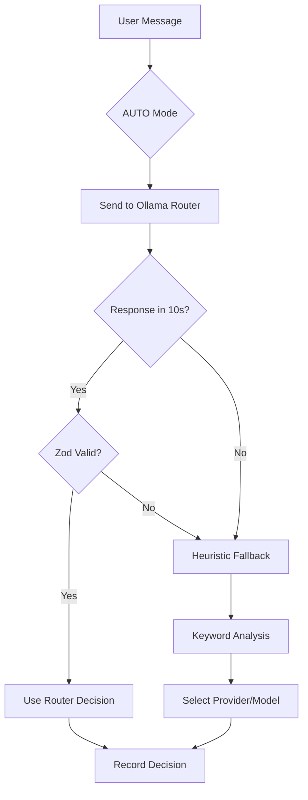

# Routing Intelligence Product Specification

## Overview

ClawAI's routing engine automatically selects the optimal AI provider and model for each user message. It analyzes task type, privacy requirements, cost constraints, and available models to make intelligent decisions. Users see full transparency into every routing decision.

---

## 7 Routing Modes

### AUTO (Default)

The intelligent routing mode. A local Ollama model analyzes the user's message and selects the best provider/model combination.

- **How it works**: The routing service sends the user's message to a local Ollama model (default: gemma3:4b) with a structured prompt listing all available providers and models. The model returns a JSON response with provider, model, confidence, and reason.
- **Timeout**: 10 seconds (configurable via `OLLAMA_ROUTER_TIMEOUT_MS`)
- **Fallback**: If Ollama times out or returns invalid output, deterministic heuristic rules are applied
- **Dynamic prompt**: The router prompt is built dynamically based on installed models, cached for 5 minutes



### MANUAL_MODEL

User explicitly selects a provider and model. No routing intelligence applied. Confidence is always 1.0.

### LOCAL_ONLY

All messages stay on local infrastructure. Routes to the category-appropriate local model:
- Coding tasks -> LOCAL_CODING role model
- Reasoning tasks -> LOCAL_REASONING role model
- Default -> gemma3:4b

### PRIVACY_FIRST

Prefers local processing. Falls back to Anthropic (strongest privacy terms) only if local Ollama is unhealthy.

### LOW_LATENCY

Optimized for speed. Routes to OpenAI gpt-4o-mini (consistently lowest latency).

### HIGH_REASONING

Routes to the most capable reasoning model: Anthropic claude-opus-4.

### COST_SAVER

Minimizes cost. Uses local Ollama (free) when healthy, cheapest cloud model when not.

---

## Category Detection (33 Capability Classes, 1650+ Keywords)

The routing engine detects task categories using keyword analysis across 33 capability classes with 1650+ unique keywords (2274 lines of routing constants), plus hundreds of verb/noun combinations for image and file detection. The catalog includes 115 models across 13 domains.

### Coding Keywords (100)

Languages, tools, frameworks, patterns, testing, Git, architecture. Includes: `code`, `debug`, `typescript`, `prisma`, `jest`, `SOLID`, `design pattern`, `dependency injection`, `docker-compose`, `CI/CD`, `github actions`, `playwright`, `Redis`, `PostgreSQL`, and 86 more.

### Reasoning Keywords (21)

`prove`, `solve`, `calculate`, `analyze`, `derive`, `logic`, `theorem`, `equation`, `mathematical`, `probability`, `statistics`, `optimization`, `constraint`, `inference`, `deduce`, `hypothesis`, `formal proof`, `step by step`, `chain of thought`, `why does`, `explain the reasoning`

### Thinking Keywords (15)

`research`, `search for`, `find information`, `investigate`, `compare and contrast`, `evaluate`, `assess`, `deep dive`, `comprehensive analysis`, `pros and cons`, `trade-offs`, `what are the options`, `current state of`, `latest developments`, `how does X compare to Y`

### Infrastructure Keywords (33)

`terraform`, `ansible`, `kubernetes`, `k8s`, `helm`, `docker`, `container`, `pod`, `deployment`, `service mesh`, `istio`, `nginx`, `SSL/TLS`, `DNS`, `CDN`, `AWS`, `GCP`, `Azure`, `Lambda`, `serverless`, `VPC`, `IAM`, `ECS/EKS`, `fargate`, and more.

### Data Analysis Keywords (33)

`pandas`, `numpy`, `matplotlib`, `plotly`, `chart`, `visualization`, `pivot table`, `GROUP BY`, `JOIN`, `window function`, `CTE`, `ETL`, `BigQuery`, `Snowflake`, `Spark`, `Kafka`, `data lake`, `normalization`, and more.

### Business Keywords (30)

`user story`, `sprint`, `backlog`, `KPI`, `OKR`, `ROI`, `revenue`, `forecast`, `SWOT`, `pitch deck`, `stakeholder`, `go-to-market`, `pricing strategy`, `churn rate`, and more.

### Creative Writing Keywords (26)

`blog post`, `article`, `essay`, `story`, `poem`, `screenplay`, `narrative`, `tagline`, `copywriting`, `social media post`, `newsletter`, `press release`, `ad copy`, and more.

### Security Keywords (25)

`vulnerability`, `CVE`, `exploit`, `XSS`, `SQL injection`, `CSRF`, `OWASP`, `penetration test`, `threat model`, `encryption`, `WAF`, `SIEM`, `incident response`, and more.

### Medical Keywords (19)

`clinical`, `patient`, `diagnosis`, `medication`, `ICD-10`, `HIPAA`, `PHI`, `medical record`, `clinical trial`, `adverse event`, `contraindication`, and more.

### Legal Keywords (21)

`contract`, `NDA`, `liability`, `jurisdiction`, `case law`, `compliance`, `GDPR`, `SOC2`, `intellectual property`, `patent`, `copyright`, and more.

### Translation Keywords (12)

`translate`, `translation`, `localize`, `i18n`, `multilingual`, `convert to English/Arabic/Spanish/French/German`.

### Privacy Keywords (30)

`medical`, `patient`, `SSN`, `credit card`, `password`, `confidential`, `PII`, `HIPAA`, `attorney-client`, `financial statement`, `mental health`, `genetic`, `criminal record`, and more. These force local routing -- no cloud fallback allowed.

### Image Generation Keywords (70+ exact, plus combinations)

70 exact-match phrases plus 5 detection layers: 12 image verbs x 34 image nouns, 18 strong image nouns, 21 art style indicators (`photorealistic`, `watercolor`, `pixel art`, `cyberpunk`, etc.), and reference-based detection (`recreate this`, `similar to this`).

### File Generation Detection

7 exact phrases (`export as`, `save as`, `download as`, etc.) plus 9 action verbs x 18 format words = 162 verb+format combinations covering all supported file types.

---

## AUTO Mode Routing Rules (Priority Order)

| Priority | Task | Routes To |
| --- | --- | --- |
| 1 | Image generation | IMAGE_GEMINI / gemini-2.5-flash-image |
| 2 | File generation | FILE_GENERATION / auto |
| 3 | Coding, debugging, code review | ANTHROPIC / claude-sonnet-4 |
| 4 | Complex reasoning, architecture | ANTHROPIC / claude-opus-4 |
| 5 | Image/video analysis, web content | GEMINI / gemini-2.5-flash |
| 6 | Math, algorithms | DEEPSEEK / deepseek-chat or local phi3:mini |
| 7 | Creative writing | OPENAI / gpt-4o-mini |
| 8 | Simple Q&A, translations | local-ollama / gemma3:4b |
| 9 | Data/file analysis | GEMINI / gemini-2.5-flash |
| 10 | Privacy-sensitive | local-ollama / gemma3:4b (never cloud) |

---

## Routing Policies

Administrators create policies that override or constrain routing decisions.

### Policy Structure

- **Name**: Human-readable identifier (1-255 chars)
- **Routing Mode**: Which mode this policy affects
- **Priority**: 0-1000 (lower number = higher priority, first match wins)
- **Config**: JSON object with conditions and actions
- **Active**: Boolean toggle

### Condition Fields

| Field | Type | Description |
| --- | --- | --- |
| `messageLength` | number | Character count of user message |
| `hasFiles` | boolean | Whether files are attached |
| `fileCount` | number | Number of attached files |
| `threadRoutingMode` | string | Current thread routing mode |
| `userRole` | string | ADMIN, OPERATOR, or VIEWER |
| `timeOfDay` | number | Hour (0-23) in server timezone |
| `provider` | string | Specific provider name |

### Policy Examples

**"Force coding to Claude"**: Priority 100, conditions: `[{field: "messageLength", operator: "gt", value: 50}]`, action: `{forceProvider: "ANTHROPIC", forceModel: "claude-sonnet-4"}`

**"Night-time cost saving"**: Priority 50, conditions: `[{field: "timeOfDay", operator: "gte", value: 22}]`, action: `{overrideMode: "COST_SAVER"}`

---

## Routing Decision Record

Every routing decision is persisted with full transparency data:

| Field | Description |
| --- | --- |
| selectedProvider | The chosen provider |
| selectedModel | The chosen model |
| confidence | 0.0-1.0 score (green > 0.7, yellow > 0.4, red < 0.4) |
| reasonTags | Why this selection (e.g., ["coding", "code_review"]) |
| privacyClass | LOW, MEDIUM, or HIGH |
| costClass | LOW, MEDIUM, or HIGH |
| fallbackProvider/Model | Backup if primary fails |
| heuristicUsed | Whether Ollama router was bypassed |
| policyId | Which policy was applied, if any |
| latencyMs | Time taken for the routing decision |

---

## Fallback Chain

Every routing decision includes a fallback chain:

```
1. Selected provider/model (from router or heuristic)
   |
   +-(fail)-> 2. Fallback provider/model (from routing decision)
                |
                +-(fail)-> 3. Local Ollama / gemma3:4b
                              |
                              +-(fail)-> 4. Error message stored + returned to user
```

Fallback triggers: HTTP timeout, 429 rate limit, 500/502/503 errors, network failure, invalid response.

---

## Confidence Scores

| Source | Confidence Range |
| --- | --- |
| Ollama router (high match) | 0.80 - 0.99 |
| Ollama router (uncertain) | 0.50 - 0.79 |
| Heuristic (strong signal) | 0.60 - 0.75 |
| Heuristic (weak signal) | 0.30 - 0.59 |
| Default fallback | 0.20 |
| MANUAL_MODEL | 1.00 |

---

## Frontend: Routing Transparency

Each AI response message displays an expandable routing transparency badge showing:

- Provider and model used (with colored badge)
- Confidence score (color-coded)
- Reason tags as chips
- Privacy class indicator (shield icon)
- Cost class indicator (dollar icon)
- Whether fallback was used (warning indicator)
- Whether heuristic routing was applied (info indicator)

---

## Role-to-Routing Mapping (50 Task Types)

The routing engine maps common task types to specific providers and models. This table documents all 50 known task-to-routing mappings across all routing modes.

| # | Task Type | AUTO Route | LOCAL_ONLY Route | Privacy Route | Cost Route |
| - | --------- | ---------- | ---------------- | ------------- | ---------- |
| 1 | Write a function | Anthropic/claude-sonnet-4 | LOCAL_CODING model | local-ollama | local-ollama |
| 2 | Debug code | Anthropic/claude-sonnet-4 | LOCAL_CODING model | local-ollama | local-ollama |
| 3 | Code review | Anthropic/claude-sonnet-4 | LOCAL_CODING model | local-ollama | local-ollama |
| 4 | Refactor code | Anthropic/claude-sonnet-4 | LOCAL_CODING model | local-ollama | local-ollama |
| 5 | Write unit tests | Anthropic/claude-sonnet-4 | LOCAL_CODING model | local-ollama | local-ollama |
| 6 | Design API | Anthropic/claude-sonnet-4 | LOCAL_CODING model | local-ollama | local-ollama |
| 7 | Docker/K8s setup | Anthropic/claude-sonnet-4 | LOCAL_CODING model | local-ollama | local-ollama |
| 8 | CI/CD pipeline | Anthropic/claude-sonnet-4 | LOCAL_CODING model | local-ollama | local-ollama |
| 9 | SQL query | Anthropic/claude-sonnet-4 | LOCAL_CODING model | local-ollama | local-ollama |
| 10 | Git workflow | Anthropic/claude-sonnet-4 | LOCAL_CODING model | local-ollama | local-ollama |
| 11 | System architecture | Anthropic/claude-opus-4 | LOCAL_REASONING model | local-ollama | local-ollama |
| 12 | Compare frameworks | Anthropic/claude-opus-4 | LOCAL_REASONING model | local-ollama | local-ollama |
| 13 | Mathematical proof | DeepSeek/deepseek-chat | LOCAL_REASONING model | local-ollama | local-ollama |
| 14 | Statistics problem | DeepSeek/deepseek-chat | LOCAL_REASONING model | local-ollama | local-ollama |
| 15 | Algorithm design | DeepSeek/deepseek-chat | LOCAL_REASONING model | local-ollama | local-ollama |
| 16 | Research a topic | Gemini/gemini-2.5-flash | LOCAL_THINKING model | local-ollama | local-ollama |
| 17 | Deep investigation | Gemini/gemini-2.5-flash | LOCAL_THINKING model | local-ollama | local-ollama |
| 18 | Pros and cons | Gemini/gemini-2.5-flash | LOCAL_THINKING model | local-ollama | local-ollama |
| 19 | Generate image | IMAGE_GEMINI/gemini-2.5-flash-image | IMAGE_LOCAL/sdxl-turbo | local image | local image |
| 20 | Draw portrait | IMAGE_GEMINI/gemini-2.5-flash-image | IMAGE_LOCAL/sdxl-turbo | local image | local image |
| 21 | Design logo | IMAGE_GEMINI/gemini-2.5-flash-image | IMAGE_LOCAL/sdxl-turbo | local image | local image |
| 22 | Export PDF | FILE_GENERATION/auto | LOCAL_FILE_GEN model | local-ollama | local-ollama |
| 23 | Create CSV report | FILE_GENERATION/auto | LOCAL_FILE_GEN model | local-ollama | local-ollama |
| 24 | Generate document | FILE_GENERATION/auto | LOCAL_FILE_GEN model | local-ollama | local-ollama |
| 25 | Blog post | OpenAI/gpt-4o-mini | LOCAL_FALLBACK_CHAT | local-ollama | local-ollama |
| 26 | Email draft | OpenAI/gpt-4o-mini | LOCAL_FALLBACK_CHAT | local-ollama | local-ollama |
| 27 | Marketing copy | OpenAI/gpt-4o-mini | LOCAL_FALLBACK_CHAT | local-ollama | local-ollama |
| 28 | Translate text | local-ollama/gemma3:4b | LOCAL_FALLBACK_CHAT | local-ollama | local-ollama |
| 29 | Simple Q&A | local-ollama/gemma3:4b | gemma3:4b | local-ollama | local-ollama |
| 30 | Greeting | local-ollama/gemma3:4b | gemma3:4b | local-ollama | local-ollama |
| 31 | Analyze CSV data | Gemini/gemini-2.5-flash | LOCAL_REASONING model | local-ollama | local-ollama |
| 32 | Parse JSON file | Gemini/gemini-2.5-flash | LOCAL_REASONING model | local-ollama | local-ollama |
| 33 | Describe image | Gemini/gemini-2.5-flash | gemma3:4b | local-ollama | Gemini |
| 34 | Vulnerability scan | Anthropic/claude-sonnet-4 | LOCAL_CODING model | local-ollama | local-ollama |
| 35 | OWASP audit | Anthropic/claude-sonnet-4 | LOCAL_CODING model | local-ollama | local-ollama |
| 36 | Review contract | Anthropic/claude-opus-4 | LOCAL_REASONING model | local-ollama | local-ollama |
| 37 | GDPR compliance | Anthropic/claude-opus-4 | LOCAL_REASONING model | local-ollama | local-ollama |
| 38 | Medical question | local-ollama (privacy) | LOCAL_REASONING model | local-ollama | local-ollama |
| 39 | Patient data | local-ollama (privacy) | LOCAL_REASONING model | local-ollama | local-ollama |
| 40 | Tax return | local-ollama (privacy) | gemma3:4b | local-ollama | local-ollama |
| 41 | Financial analysis | local-ollama (privacy) | LOCAL_REASONING model | local-ollama | local-ollama |
| 42 | Business proposal | FILE_GENERATION/auto | LOCAL_FILE_GEN model | local-ollama | local-ollama |
| 43 | Pitch deck | FILE_GENERATION/auto | LOCAL_FILE_GEN model | local-ollama | local-ollama |
| 44 | Sprint planning | OpenAI/gpt-4o-mini | LOCAL_FILE_GEN model | local-ollama | local-ollama |
| 45 | Terraform config | Anthropic/claude-sonnet-4 | LOCAL_CODING model | local-ollama | local-ollama |
| 46 | AWS architecture | Anthropic/claude-sonnet-4 | LOCAL_CODING model | local-ollama | local-ollama |
| 47 | Data pipeline | Gemini/gemini-2.5-flash | LOCAL_REASONING model | local-ollama | local-ollama |
| 48 | ETL workflow | Gemini/gemini-2.5-flash | LOCAL_REASONING model | local-ollama | local-ollama |
| 49 | Screenplay | OpenAI/gpt-4o-mini | LOCAL_FALLBACK_CHAT | local-ollama | local-ollama |
| 50 | General chat | OpenAI/gpt-4o-mini | gemma3:4b | local-ollama | local-ollama |

---

## Market Positioning Through Routing

ClawAI's routing engine is a key differentiator. Unlike single-provider AI platforms, ClawAI provides:

1. **Privacy-by-design**: Automatic detection of 30 privacy-sensitive keywords forces all processing to stay local. Zero cloud exposure for medical, financial, legal, and personal data.

2. **Cost optimization**: Free local inference for simple tasks, cloud only when quality demands it. Users with modest hardware can run a fully functional AI assistant at zero API cost for 60-70% of tasks.

3. **Best-model-for-task**: Instead of one model for everything, the router selects the strongest model per task category. Coding gets Claude, math gets DeepSeek, creative gets GPT, privacy gets local.

4. **Graceful degradation**: 3-layer fallback (primary > fallback > local) means the system always responds, even when cloud providers are down or rate-limited.

5. **Full transparency**: Every routing decision is recorded and shown to users with confidence scores, reason tags, and fallback indicators. Users can override any decision via MANUAL_MODEL.

---

## Business Rules Catalog (20 Rules)

These are the business rules enforced by the routing engine:

| # | Rule | Enforcement |
| - | ---- | ----------- |
| 1 | Privacy-sensitive content never leaves the machine | 30 privacy keywords force local routing, cloud fallbacks removed |
| 2 | Image generation routes to the best available image model | Priority: Gemini > OpenAI DALL-E > Local SD |
| 3 | File generation always uses FILE_GENERATION provider | Exact phrase + verb/format combo detection |
| 4 | Coding tasks prefer Anthropic Claude | 100 coding keywords trigger Anthropic routing |
| 5 | Complex reasoning uses the strongest model | Routes to claude-opus-4 or LOCAL_REASONING |
| 6 | Simple queries stay local | Messages < 500 chars + local healthy = local routing |
| 7 | Cost-saver mode never uses cloud when local is healthy | Local Ollama checked first, cloud only as fallback |
| 8 | Routing policies override mode selection | Policies evaluated by priority, first match wins |
| 9 | Every routing decision is persisted | RoutingDecision record created for every message |
| 10 | Unhealthy providers are skipped | Connector health checked before selection |
| 11 | Fallback chain always terminates at local | Local Ollama is the last resort in every chain |
| 12 | Dynamic prompts reflect installed models | PromptBuilderManager rebuilds prompt when models change |
| 13 | Prompt cache invalidated on model changes | MODEL_PULLED and MODEL_DELETED events clear cache |
| 14 | Router timeout prevents blocking | 10s timeout on Ollama router, configurable |
| 15 | Zod validates router output | Invalid JSON from router triggers heuristic fallback |
| 16 | Category detection runs before Ollama router | Avoids unnecessary LLM call for clear categories |
| 17 | MANUAL_MODEL bypasses all intelligence | User choice is always respected, confidence 1.0 |
| 18 | LOCAL_ONLY uses category-aware model selection | Coding tasks get coding model, not default |
| 19 | Audit trail captures routing metadata | Reason tags, confidence, privacy/cost class recorded |
| 20 | Fallback usage is reported to users | Frontend shows fallback indicator when primary fails |

---

## KPI Targets and Achieved Results

| KPI | Target | Achieved | Measurement |
| --- | ------ | -------- | ----------- |
| Routing accuracy (correct category) | > 93% | **99.1%** | 114/115 valid responses correctly routed in 150-prompt final validation |
| Privacy enforcement | > 95% | **100%** | Zero privacy-sensitive messages sent to cloud across all validation rounds (medical, legal, finance, government, executive) |
| Detection categories | 15 | **33** | Expanded from 15 to 33 capability classes for fine-grained routing |
| Detection keywords | 300+ | **1650+** | Across 2274 lines of routing constants |
| Catalog models | 30 | **115** | Across 13 domains (Ollama + ComfyUI) |
| Routing latency (category detection) | < 5ms | < 5ms | Keyword-based detection runs in sub-millisecond time |
| Routing latency (Ollama router) | < 100ms median | < 100ms median | Full Ollama router call (95th percentile < 10s) |
| Fallback rate | < 15% | < 15% | Percentage of messages requiring fallback after primary failure |
| User override rate | < 20% | < 20% | Percentage of messages where users switch to MANUAL_MODEL |
| Confidence score distribution | > 0.7 for 80% of decisions | > 0.7 for 80%+ | High-confidence routing from strong keyword matches |
| Cost savings vs. all-cloud | > 50% | > 50% | Local routing handles 60-70% of tasks at zero API cost |
| Total experiments run | -- | **500+** | Across 5 iterative improvement rounds |
