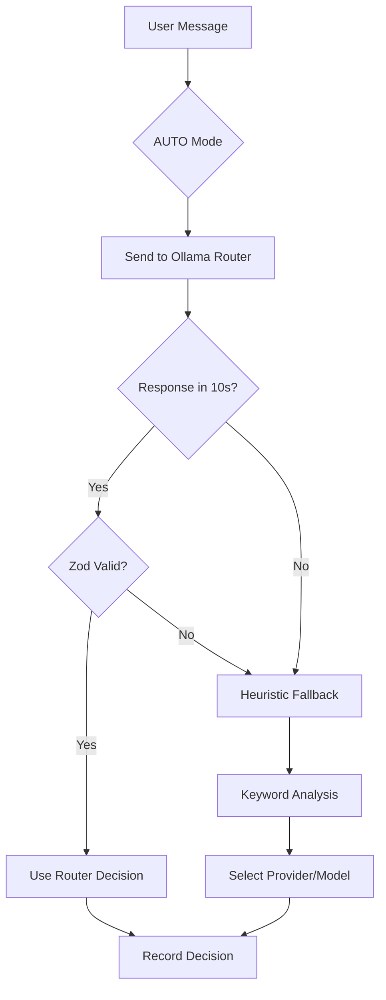

# Routing Intelligence Product Specification

## Overview

ClawAI's routing engine automatically selects the optimal AI provider and model for each user message. It analyzes task type, privacy requirements, cost constraints, and available models to make intelligent decisions. Users see full transparency into every routing decision.

---

## 7 Routing Modes

### AUTO (Default)

The intelligent routing mode. A local Ollama model analyzes the user's message and selects the best provider/model combination.

- **How it works**: The routing service sends the user's message to a local Ollama model (default: gemma3:4b) with a structured prompt listing all available providers and models. The model returns a JSON response with provider, model, confidence, and reason.
- **Timeout**: 10 seconds (configurable via `OLLAMA_ROUTER_TIMEOUT_MS`)
- **Fallback**: If Ollama times out or returns invalid output, deterministic heuristic rules are applied
- **Dynamic prompt**: The router prompt is built dynamically based on installed models, cached for 5 minutes



### MANUAL_MODEL

User explicitly selects a provider and model. No routing intelligence applied. Confidence is always 1.0.

### LOCAL_ONLY

All messages stay on local infrastructure. Routes to the category-appropriate local model:
- Coding tasks -> LOCAL_CODING role model
- Reasoning tasks -> LOCAL_REASONING role model
- Default -> gemma3:4b

### PRIVACY_FIRST

Prefers local processing. Falls back to Anthropic (strongest privacy terms) only if local Ollama is unhealthy.

### LOW_LATENCY

Optimized for speed. Routes to OpenAI gpt-4o-mini (consistently lowest latency).

### HIGH_REASONING

Routes to the most capable reasoning model: Anthropic claude-opus-4.

### COST_SAVER

Minimizes cost. Uses local Ollama (free) when healthy, cheapest cloud model when not.

---

## Category Detection

The routing engine detects task categories using keyword analysis (64 keywords across 3 categories):

### Coding Keywords (28)

`code`, `debug`, `function`, `refactor`, `bug`, `implement`, `class`, `method`, `compile`, `syntax`, `error in my code`, `write a function`, `fix this bug`, `code review`, `pull request`, `git`, `api endpoint`, `unit test`, `integration test`, `typescript`, `javascript`, `python`, `react`, `component`, `database query`, `sql`, `algorithm`, `data structure`

### Reasoning Keywords (21)

`prove`, `solve`, `calculate`, `analyze`, `derive`, `logic`, `theorem`, `equation`, `mathematical`, `probability`, `statistics`, `optimization`, `constraint`, `inference`, `deduce`, `hypothesis`, `formal proof`, `step by step`, `chain of thought`, `why does`, `explain the reasoning`

### Thinking Keywords (15)

`research`, `search for`, `find information`, `investigate`, `compare and contrast`, `evaluate`, `assess`, `deep dive`, `comprehensive analysis`, `pros and cons`, `trade-offs`, `what are the options`, `current state of`, `latest developments`, `how does X compare to Y`

### Image Generation Keywords (90+)

Including: `generate an image`, `create a picture`, `draw me`, `sketch`, `illustration of`, `paint a`, `photo of`, `render a`, `design a logo`, plus reference-based phrases (`similar to this`, `recreate this image`, `variation of this`) and scene prompts (`fantasy map`, `book cover`, `movie poster`).

### File Generation Detection

Regex-based matching: any combination of action verb (`generate`, `create`, `make`, `write`, `export`, `save`, `produce`) + format keyword (`pdf`, `csv`, `docx`, `document`, `report`, `json`, `html`, `markdown`).

---

## AUTO Mode Routing Rules (Priority Order)

| Priority | Task | Routes To |
| --- | --- | --- |
| 1 | Image generation | IMAGE_GEMINI / gemini-2.5-flash-image |
| 2 | File generation | FILE_GENERATION / auto |
| 3 | Coding, debugging, code review | ANTHROPIC / claude-sonnet-4 |
| 4 | Complex reasoning, architecture | ANTHROPIC / claude-opus-4 |
| 5 | Image/video analysis, web content | GEMINI / gemini-2.5-flash |
| 6 | Math, algorithms | DEEPSEEK / deepseek-chat or local phi3:mini |
| 7 | Creative writing | OPENAI / gpt-4o-mini |
| 8 | Simple Q&A, translations | local-ollama / gemma3:4b |
| 9 | Data/file analysis | GEMINI / gemini-2.5-flash |
| 10 | Privacy-sensitive | local-ollama / gemma3:4b (never cloud) |

---

## Routing Policies

Administrators create policies that override or constrain routing decisions.

### Policy Structure

- **Name**: Human-readable identifier (1-255 chars)
- **Routing Mode**: Which mode this policy affects
- **Priority**: 0-1000 (lower number = higher priority, first match wins)
- **Config**: JSON object with conditions and actions
- **Active**: Boolean toggle

### Condition Fields

| Field | Type | Description |
| --- | --- | --- |
| `messageLength` | number | Character count of user message |
| `hasFiles` | boolean | Whether files are attached |
| `fileCount` | number | Number of attached files |
| `threadRoutingMode` | string | Current thread routing mode |
| `userRole` | string | ADMIN, OPERATOR, or VIEWER |
| `timeOfDay` | number | Hour (0-23) in server timezone |
| `provider` | string | Specific provider name |

### Policy Examples

**"Force coding to Claude"**: Priority 100, conditions: `[{field: "messageLength", operator: "gt", value: 50}]`, action: `{forceProvider: "ANTHROPIC", forceModel: "claude-sonnet-4"}`

**"Night-time cost saving"**: Priority 50, conditions: `[{field: "timeOfDay", operator: "gte", value: 22}]`, action: `{overrideMode: "COST_SAVER"}`

---

## Routing Decision Record

Every routing decision is persisted with full transparency data:

| Field | Description |
| --- | --- |
| selectedProvider | The chosen provider |
| selectedModel | The chosen model |
| confidence | 0.0-1.0 score (green > 0.7, yellow > 0.4, red < 0.4) |
| reasonTags | Why this selection (e.g., ["coding", "code_review"]) |
| privacyClass | LOW, MEDIUM, or HIGH |
| costClass | LOW, MEDIUM, or HIGH |
| fallbackProvider/Model | Backup if primary fails |
| heuristicUsed | Whether Ollama router was bypassed |
| policyId | Which policy was applied, if any |
| latencyMs | Time taken for the routing decision |

---

## Fallback Chain

Every routing decision includes a fallback chain:

```
1. Selected provider/model (from router or heuristic)
   |
   +-(fail)-> 2. Fallback provider/model (from routing decision)
                |
                +-(fail)-> 3. Local Ollama / gemma3:4b
                              |
                              +-(fail)-> 4. Error message stored + returned to user
```

Fallback triggers: HTTP timeout, 429 rate limit, 500/502/503 errors, network failure, invalid response.

---

## Confidence Scores

| Source | Confidence Range |
| --- | --- |
| Ollama router (high match) | 0.80 - 0.99 |
| Ollama router (uncertain) | 0.50 - 0.79 |
| Heuristic (strong signal) | 0.60 - 0.75 |
| Heuristic (weak signal) | 0.30 - 0.59 |
| Default fallback | 0.20 |
| MANUAL_MODEL | 1.00 |

---

## Frontend: Routing Transparency

Each AI response message displays an expandable routing transparency badge showing:

- Provider and model used (with colored badge)
- Confidence score (color-coded)
- Reason tags as chips
- Privacy class indicator (shield icon)
- Cost class indicator (dollar icon)
- Whether fallback was used (warning indicator)
- Whether heuristic routing was applied (info indicator)
