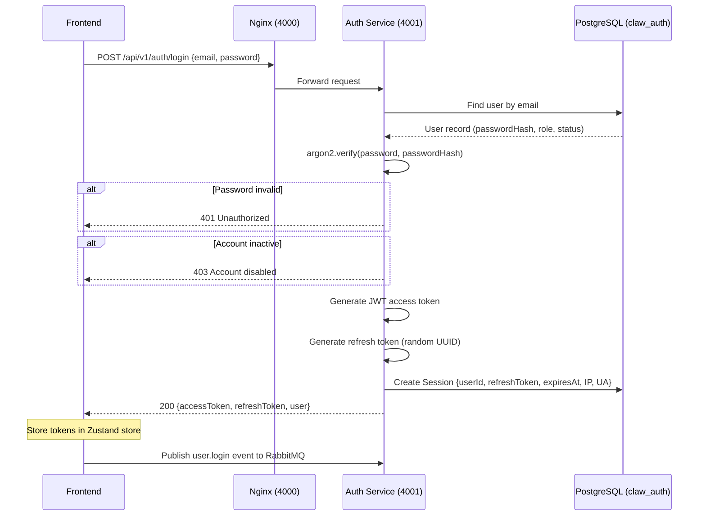
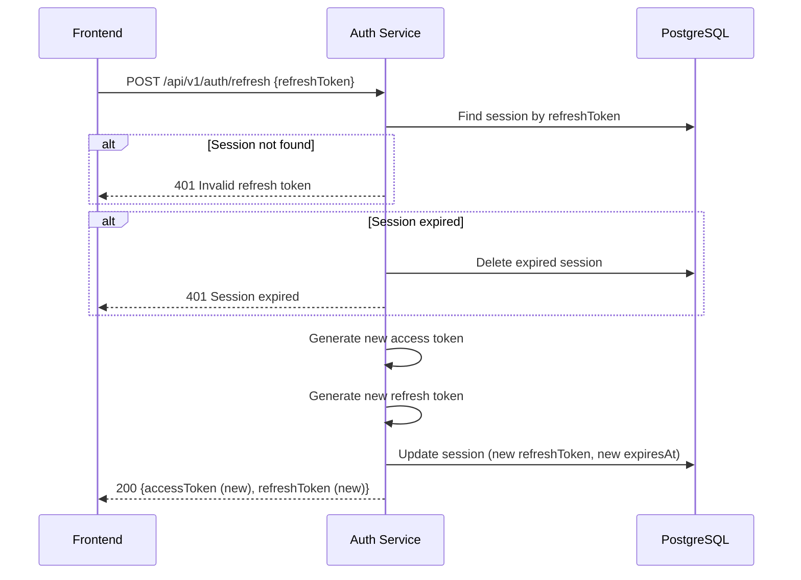
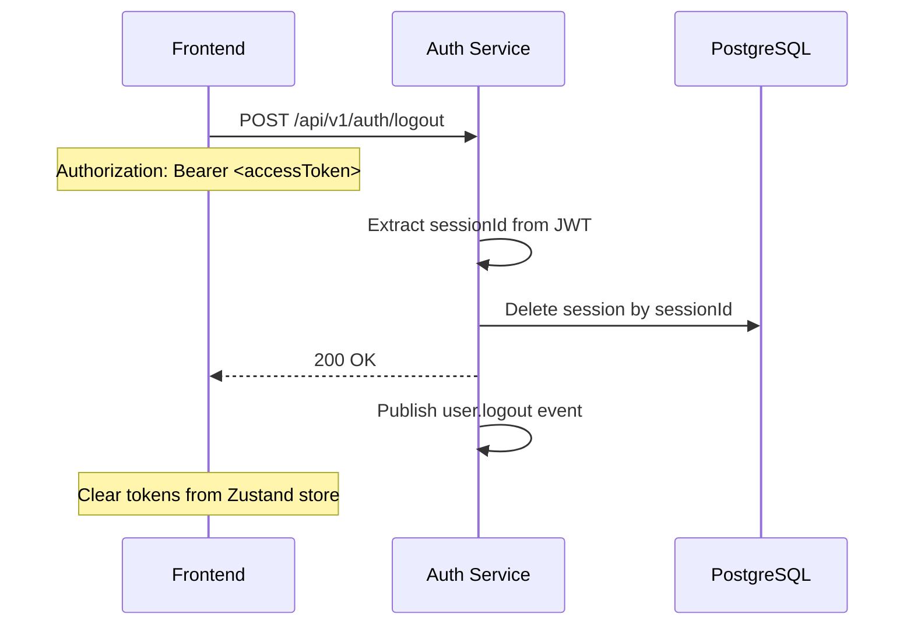

# Authentication Flow

## Overview

ClawAI uses a dual-token authentication scheme with JWT access tokens and refresh token rotation. Passwords are hashed with argon2id. Sessions are tracked in PostgreSQL with IP and user agent metadata.

---

## Login Flow



### Access Token Contents

```json
{
  "sub": "user-uuid",
  "email": "user@example.com",
  "role": "OPERATOR",
  "sessionId": "session-uuid",
  "iat": 1712800000,
  "exp": 1712800900
}
```

### Token Lifetimes

| Token | Default | Environment Variable |
| --- | --- | --- |
| Access Token | 15 minutes | `JWT_ACCESS_EXPIRY` |
| Refresh Token | 7 days | `JWT_REFRESH_EXPIRY` |

---

## Token Refresh Flow



### Rotation Security Properties

1. **Single-use tokens**: Each refresh token can only be used once. After rotation, the old token is invalidated.
2. **Theft detection**: If an attacker steals and uses a refresh token, the legitimate user's next refresh attempt fails (token already rotated). This signals a compromised session.
3. **No replay**: Old refresh tokens cannot be replayed after rotation.
4. **Session binding**: Refresh tokens are tied to a specific session record in the database.

---

## Logout Flow



---

## Session Management

### Session Record

```
Session {
  id:           UUID
  userId:       UUID
  refreshToken: String (hashed)
  expiresAt:    DateTime
  ipAddress:    String
  userAgent:    String
  createdAt:    DateTime
  updatedAt:    DateTime
}
```

### Session Operations

| Operation | Endpoint | Access |
| --- | --- | --- |
| List sessions | GET /api/v1/auth/sessions | ADMIN (all), OPERATOR (own) |
| Revoke session | DELETE /api/v1/auth/sessions/:id | ADMIN (any), OPERATOR (own) |
| Revoke all | DELETE /api/v1/auth/sessions | ADMIN only (force logout all) |

### Session Cleanup

- Expired sessions are cleaned up periodically
- Logout deletes the session immediately
- Revoking a session invalidates its refresh token

---

## Password Security

### Hashing Algorithm: argon2id

- **Memory cost**: Default argon2 parameters (memory-hard)
- **Time cost**: Default iterations
- **Parallelism**: Default threads
- **Resistance**: GPU/ASIC attack resistant due to memory-hardness

### Password Requirements

Enforced via Zod schema at registration and password change:
- Minimum length (configurable)
- No plaintext storage at any point
- No plaintext logging (Pino redaction covers `password` field)
- No plaintext transmission (HTTPS in production)

---

## Frontend Token Handling

### Token Storage

Currently stored in Zustand store (in-memory) with localStorage persistence:

```typescript
// auth.store.ts (Zustand)
{
  accessToken: string | null
  refreshToken: string | null
  user: User | null
}
```

**Known Issue (TD-008)**: localStorage is vulnerable to XSS. Planned migration to httpOnly cookies.

### Automatic Token Refresh

The HTTP client interceptor (`http-client.ts`) handles 401 responses:

1. Intercept 401 response
2. Attempt token refresh (POST /auth/refresh)
3. If refresh succeeds: retry the original request with new token
4. If refresh fails: redirect to login page

### SSE Authentication

- `EventSource` API cannot set Authorization headers
- ClawAI uses `fetch()` with `ReadableStream` for SSE connections
- Authorization header is set on the fetch request
- Token refresh is NOT automatic for SSE connections (requires reconnection)

---

## Request Authentication Pipeline

```
1. Request arrives at NestJS service
2. AuthGuard (global) checks for @Public() decorator
   -> If @Public(): skip authentication
3. Extract JWT from Authorization: Bearer <token>
   -> If missing: 401 Unauthorized
4. Verify JWT signature using JWT_SECRET
   -> If invalid: 401 Unauthorized
5. Check token expiry
   -> If expired: 401 Unauthorized
6. Decode payload, attach user to request.user
7. RolesGuard checks @Roles() decorator (if present)
   -> If role not allowed: 403 Forbidden
8. Request proceeds to controller
```

---

## Audit Trail

Every authentication event is published to RabbitMQ and consumed by the audit service:

| Event | Trigger | Payload |
| --- | --- | --- |
| `user.login` | Successful login | userId, email, role, sessionId, IP, userAgent |
| `user.logout` | Logout or session revocation | userId, sessionId, reason |

Failed login attempts are logged but not published as events (to prevent event flooding during brute-force attacks).
