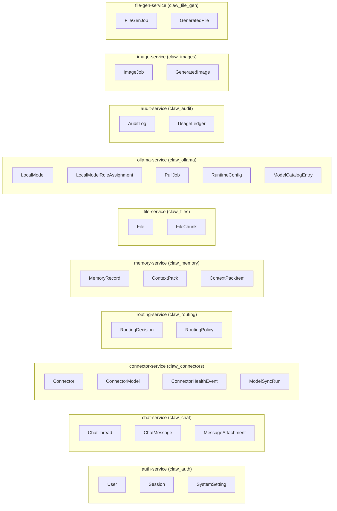

# Data Ownership & Inter-Service Communication

## Overview

ClawAI enforces strict data ownership boundaries. Each service owns its database exclusively. No service reads from or writes to another service's database. Cross-service data access happens through HTTP calls (synchronous) or RabbitMQ events (asynchronous).

---

## Ownership Map



---

## Rules

### Rule 1: Exclusive Database Ownership

Each service connects to its own database(s) and nothing else. The connection strings are configured per-service in the `.env` file:

```
AUTH_DATABASE_URL=postgresql://...@db:5432/claw_auth
CHAT_DATABASE_URL=postgresql://...@db:5433/claw_chat
CONNECTORS_DATABASE_URL=postgresql://...@db:5434/claw_connectors
...
```

### Rule 2: No Cross-Database Queries

Even though all PostgreSQL databases run on the same host (in development), services never issue queries across database boundaries. No foreign keys reference tables in other databases.

### Rule 3: Data Access via APIs

When a service needs data from another service, it uses:
- **HTTP**: For synchronous request-response needs
- **RabbitMQ events**: For async notifications with data payloads

### Rule 4: Event Payloads Are Self-Contained

Events carry all data the consumer needs. The consumer does not need to call back to the publisher to get additional information. For example, `message.completed` includes both userContent and assistantContent so memory-service can extract memories without calling chat-service.

---

## Inter-Service Communication Patterns

### HTTP (Synchronous)

| Caller | Callee | Endpoint | Purpose |
| --- | --- | --- | --- |
| chat-service | memory-service | GET /memories | Fetch user memories for context |
| chat-service | memory-service | GET /context-packs/:id/items | Fetch context pack items |
| chat-service | file-service | GET /files/:id/chunks | Fetch file chunks for context |
| chat-service | ollama-service | POST /ollama/generate | Local LLM generation |
| chat-service | connector-service | POST /connectors/:id/proxy | Cloud provider API call |
| routing-service | ollama-service | POST /ollama/generate | Router model inference |
| routing-service | ollama-service | GET /internal/ollama/installed-models | Get installed models for prompt building |
| health-service | all services | GET /health | Health aggregation |

### RabbitMQ (Asynchronous)

| Publisher | Event | Consumer(s) | Data Flow |
| --- | --- | --- | --- |
| chat-service | message.created | routing-service | Message content + thread settings |
| routing-service | message.routed | chat-service | Provider/model selection + fallback |
| chat-service | message.completed | memory-service | Full message content for extraction |
| chat-service | message.completed | audit-service | Token counts, provider, latency |
| auth-service | user.login | audit-service | User ID, IP, user agent |
| connector-service | connector.synced | routing-service | Available models updated |
| all services | log.server | server-logs-service | Structured log entry |

---

## Why This Design

### Benefits

1. **Independent deployment**: Each service can be updated, restarted, or scaled without affecting others' data.
2. **Technology flexibility**: Each service can choose the best database technology (PostgreSQL, MongoDB) for its workload.
3. **Failure isolation**: A database failure in one service does not cascade to others.
4. **Clear boundaries**: Ownership is unambiguous. When debugging a data issue, you know exactly which service to investigate.
5. **Security**: Services cannot accidentally access sensitive data they don't need (e.g., chat-service cannot read encrypted API keys in connector-service's database).

### Tradeoffs

1. **Increased latency**: Cross-service data access requires HTTP calls instead of simple joins.
2. **Eventual consistency**: RabbitMQ events introduce a delay between data changes and downstream updates.
3. **More infrastructure**: 9 PostgreSQL databases + 3 MongoDB databases require more resources than a single shared database.
4. **Data duplication**: Event payloads sometimes duplicate data that already exists in the publisher's database.

### Mitigations

- **HTTP calls are parallel**: Context assembly makes concurrent requests to memory-service and file-service.
- **Event payloads are self-contained**: Consumers rarely need to make additional HTTP calls after receiving an event.
- **Caching**: Routing prompt is cached for 5 minutes to avoid repeated calls to ollama-service.
- **Graceful degradation**: If memory-service is down, chat continues without memories (logs a warning).

---

## Data Flow for Key Operations

### Creating a Connector

```
Admin -> connector-service: POST /connectors
connector-service: Store in claw_connectors.Connector (encrypted API key)
connector-service -> RabbitMQ: connector.created
RabbitMQ -> audit-service: Store in claw_audit.AuditLog
```

### Fetching Context for a Message

```
chat-service -> memory-service: GET /memories?userId=X
  memory-service: Query claw_memory.MemoryRecord
  memory-service -> chat-service: [memory1, memory2, ...]

chat-service -> file-service: GET /files/:id/chunks
  file-service: Query claw_files.FileChunk
  file-service -> chat-service: [chunk1, chunk2, ...]
```

### User Login Audit

```
auth-service: Verify password against claw_auth.User
auth-service: Create claw_auth.Session
auth-service -> RabbitMQ: user.login
RabbitMQ -> audit-service: Store in claw_audit.AuditLog
```

No service ever directly queries another service's database tables.
