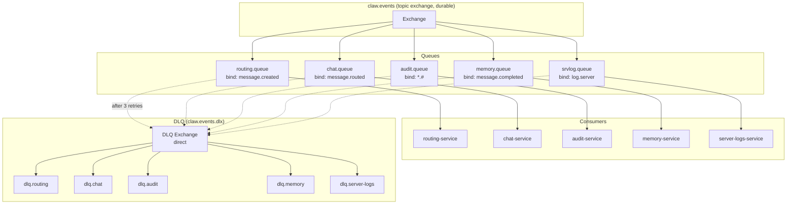
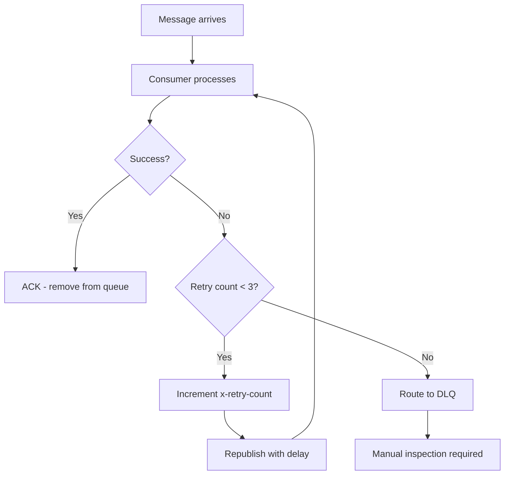

# Event-Driven Architecture

## Overview

ClawAI uses RabbitMQ as its asynchronous event bus to decouple services and enable event-driven workflows. All inter-service events flow through a single topic exchange with routing-key-based filtering, dead-letter queues, and automatic retry with exponential backoff.

---

## Exchange Topology



---

## Event Catalog

### Core Message Flow Events

| Event | Publisher | Consumers | Trigger |
| --- | --- | --- | --- |
| `message.created` | chat-service | routing-service | User sends a message |
| `message.routed` | routing-service | chat-service | Routing decision made |
| `message.completed` | chat-service | memory-service, audit-service | AI response stored |
| `thread.created` | chat-service | (none) | New thread created |

### Authentication Events

| Event | Publisher | Consumers | Trigger |
| --- | --- | --- | --- |
| `user.login` | auth-service | audit-service | Successful login |
| `user.logout` | auth-service | audit-service | Logout or session revocation |

### Connector Events

| Event | Publisher | Consumers | Trigger |
| --- | --- | --- | --- |
| `connector.created` | connector-service | audit-service | New connector configured |
| `connector.updated` | connector-service | audit-service | Connector config changed |
| `connector.deleted` | connector-service | audit-service | Connector removed |
| `connector.synced` | connector-service | audit-service, routing-service | Model sync completed |
| `connector.health_checked` | connector-service | audit-service, routing-service | Health check result |

### Routing Events

| Event | Publisher | Consumers | Trigger |
| --- | --- | --- | --- |
| `routing.decision_made` | routing-service | audit-service | Every routing decision |

### Memory Events

| Event | Publisher | Consumers | Trigger |
| --- | --- | --- | --- |
| `memory.extracted` | memory-service | audit-service | Memories extracted from conversation |

### File Events

| Event | Publisher | Consumers | Trigger |
| --- | --- | --- | --- |
| `file.uploaded` | file-service | (none) | File uploaded |
| `file.chunked` | file-service | (none) | File chunked |

### Image Events

| Event | Publisher | Consumers | Trigger |
| --- | --- | --- | --- |
| `image.generated` | image-service | audit-service | Image generated |
| `image.failed` | image-service | audit-service | Image generation failed |

### File Generation Events

| Event | Publisher | Consumers | Trigger |
| --- | --- | --- | --- |
| `file.generated` | file-gen-service | audit-service | File generated |
| `file_generation.failed` | file-gen-service | audit-service | File generation failed |

### Logging Events

| Event | Publisher | Consumers | Trigger |
| --- | --- | --- | --- |
| `log.server` | all 13 services | server-logs-service | Any structured log entry |

---

## Retry and DLQ Strategy

### Retry Configuration

```
Max retries:     3
Retry delay 1:   1 second
Retry delay 2:   5 seconds
Retry delay 3:   30 seconds
Strategy:        Exponential backoff with fixed delays
```

### Retry Flow



### Error Classification

| Error Type | Retry? | Example |
| --- | --- | --- |
| Transient | Yes (up to 3) | Database timeout, Ollama unreachable, network glitch |
| Permanent | No (immediate DLQ) | Invalid payload, missing required fields, schema violation |
| Unknown | Yes (up to 3) | Unhandled exceptions |

---

## Idempotency

Since RabbitMQ provides at-least-once delivery, consumers must be idempotent:

| Consumer | Idempotency Mechanism |
| --- | --- |
| Memory extraction | Dedup check against existing memories before insert |
| Audit logging | messageId as natural idempotency key |
| Routing decisions | One decision per messageId (unique constraint) |
| Server log ingestion | Timestamp + requestId dedup |

---

## Ordering Guarantees

### Within a Queue
FIFO ordering with a single consumer. Messages are delivered in publish order.

### Across Queues
No ordering guarantee. `message.created` and `message.routed` may be processed by different consumers at different times. The system handles this via:
- **Causal ordering**: `message.routed` is only published after routing service finishes processing `message.created`
- **State checks**: Consumers verify prerequisite state exists before processing

### Parallelism
Multiple instances of a service can consume from the same queue (competing consumers). Messages are distributed round-robin. This enables horizontal scaling of consumers.

---

## Shared RabbitMQ Package

The `shared-rabbitmq` package (in `packages/shared-rabbitmq`) provides:

### RabbitMQModule
NestJS dynamic module for connection setup:
- Connection string configuration
- Exchange declaration (create if not exists)
- Queue declaration and binding
- Automatic reconnection with backoff

### RabbitMQService
Publishing abstraction:
- `publish(routingKey, payload)` method
- Automatic JSON serialization
- Standard headers: `x-timestamp`, `x-source-service`, `x-request-id`
- 3 retry attempts on publish failure

### StructuredLogger
Logger that publishes `log.server` events:
- Wraps NestJS Logger
- Includes service name, module, request context
- Automatic field redaction before publishing

---

## Monitoring

### RabbitMQ Management Plugin

Available at port 15672 (configurable via `RABBITMQ_MANAGEMENT_PORT`).

Key metrics to monitor:
- **Queue depth**: Messages waiting for consumers (should be near 0)
- **Consumer count**: Active consumers per queue
- **Publish rate**: Messages/second published
- **Consume rate**: Messages/second consumed
- **DLQ depth**: Failed messages requiring attention

### DLQ Resolution

Messages in DLQ indicate:
1. A consumer bug (most common) -- fix the bug, replay messages
2. A downstream dependency failure -- fix the dependency, replay messages
3. A malformed event payload -- investigate publisher, discard if appropriate

Replay procedure: Move messages from DLQ back to the original queue after fixing the issue.
