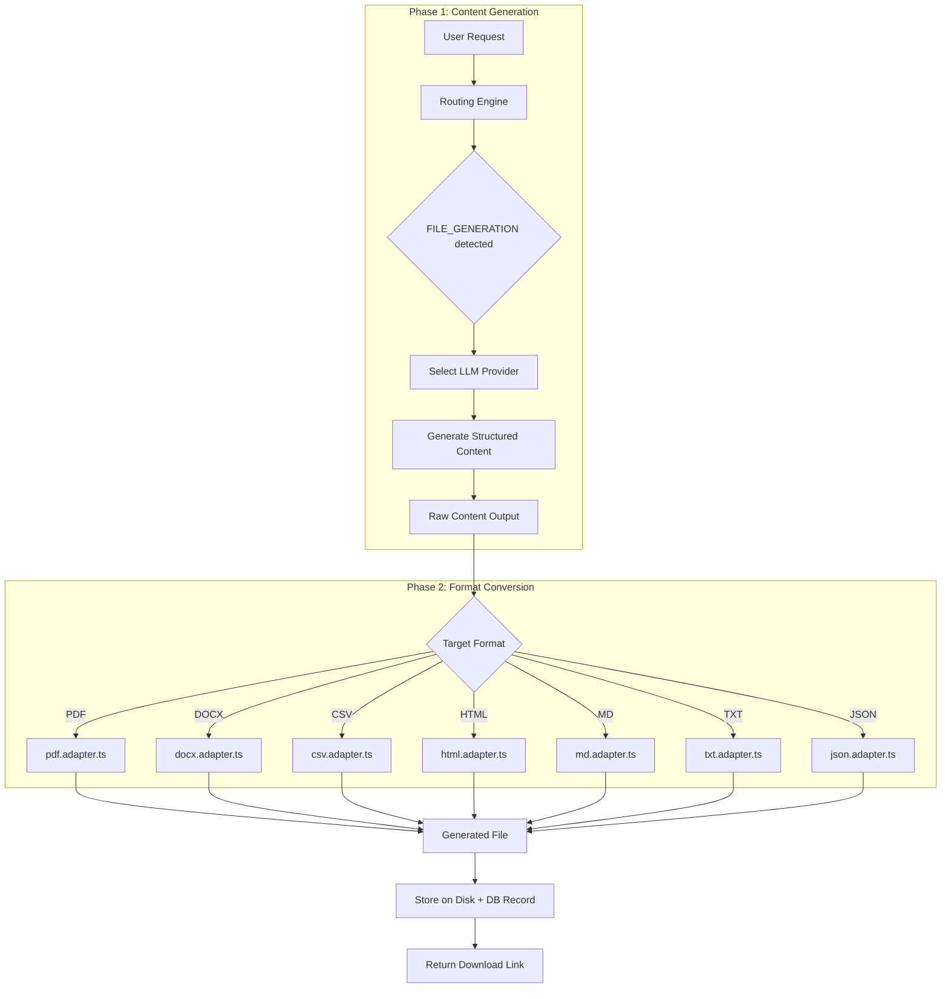

# File Generation Architecture

## Overview

The file generation pipeline uses a two-phase approach: Phase 1 uses an LLM to generate structured content, Phase 2 uses format-specific adapters to convert that content into downloadable files. The system supports 7 output formats through dedicated adapter classes.

---

## Two-Phase Architecture



---

## Phase 1: LLM Content Generation

### Intent Detection

The routing engine detects file generation requests using a combined approach:

**Regex Matching**: Action verb + format keyword
- Verbs: `generate`, `create`, `make`, `write`, `export`, `save`, `output`, `produce`, `build`
- Formats: `file`, `pdf`, `document`, `csv`, `docx`, `word`, `txt`, `text file`, `markdown`, `json`, `html`, `report`, `.md`, `.pdf`, `.csv`, `.docx`, `.txt`, `.json`, `.html`

**Exact Phrases** (high confidence):
- `export as`, `export to`, `save as`, `download as`, `save to file`, `write to file`, `output as file`

### Provider Selection

When routing to FILE_GENERATION:
- If a LOCAL_FILE_GENERATION role model is assigned, use it
- Otherwise, use the default local model (gemma3:4b)
- Cloud fallback available if local is unhealthy

### Content Generation Prompt

The LLM receives a structured prompt asking it to generate content appropriate for the target format:
- For CSV: Generate tabular data with headers and rows
- For JSON: Generate valid JSON structure
- For PDF/DOCX: Generate formatted text with sections
- For Markdown/HTML: Generate markup-ready content
- For TXT: Generate clean plain text

---

## Phase 2: Format Adapters

### Adapter Interface

Each adapter implements a common interface:

```
Input:  LLM-generated content (string)
Output: File buffer (Buffer) + metadata (filename, mimeType, sizeBytes)
```

### 7 Adapters

| Adapter | File | MIME Type | Key Libraries |
| --- | --- | --- | --- |
| `pdf.adapter.ts` | .pdf | application/pdf | PDF generation library |
| `docx.adapter.ts` | .docx | application/vnd.openxmlformats-officedocument.wordprocessingml.document | DOCX builder |
| `csv.adapter.ts` | .csv | text/csv | CSV parser/formatter |
| `html.adapter.ts` | .html | text/html | HTML template engine |
| `md.adapter.ts` | .md | text/markdown | Direct passthrough (LLM generates valid MD) |
| `txt.adapter.ts` | .txt | text/plain | Direct passthrough |
| `json.adapter.ts` | .json | application/json | JSON.parse validation + formatting |

### Adapter Responsibilities

Each adapter:
1. Receives raw LLM output
2. Validates/parses the content for the target format
3. Applies format-specific transformations
4. Generates the final file buffer
5. Returns the file with metadata

---

## Service Architecture

```
file-generation-service (port 4013)
  |
  +-- controllers/
  |     +-- file-generation.controller.ts   (3-line methods)
  |
  +-- services/
  |     +-- file-generation.service.ts      (orchestration)
  |
  +-- managers/
  |     +-- file-generation.manager.ts      (LLM call + adapter dispatch)
  |
  +-- adapters/
  |     +-- pdf.adapter.ts
  |     +-- docx.adapter.ts
  |     +-- csv.adapter.ts
  |     +-- html.adapter.ts
  |     +-- md.adapter.ts
  |     +-- txt.adapter.ts
  |     +-- json.adapter.ts
  |
  +-- repositories/
  |     +-- file-generation.repository.ts   (data access)
  |
  +-- dto/
  |     +-- create-file-generation.dto.ts   (Zod schema)
  |
  +-- types/
        +-- file-generation.types.ts
```

---

## Data Model

### FileGenerationJob (claw_file_generations)

```
id:           UUID
userId:       UUID
prompt:       String        User's original request
format:       Enum          PDF | DOCX | CSV | HTML | MD | TXT | JSON
status:       Enum          PENDING | IN_PROGRESS | COMPLETED | FAILED
filePath:     String?       Path to generated file on disk
fileName:     String?       Generated filename
sizeBytes:    BigInt?       File size
error:        String?       Error message on failure
provider:     String        LLM provider used for content generation
model:        String        LLM model used
createdAt:    DateTime
updatedAt:    DateTime
```

---

## API Endpoints

| Endpoint | Method | Auth | Description |
| --- | --- | --- | --- |
| `/api/v1/file-generations` | POST | Yes | Create file generation request |
| `/api/v1/file-generations` | GET | Yes | List user's generations (paginated) |
| `/api/v1/file-generations/:id` | GET | Yes | Get generation details |
| `/api/v1/file-generations/:id/download` | GET | Yes | Download generated file |

---

## Events

| Event | Publisher | Consumers | Payload |
| --- | --- | --- | --- |
| `file.generated` | file-gen-service | audit-service | jobId, userId, format, provider, fileName |
| `file_generation.failed` | file-gen-service | audit-service | jobId, userId, format, error |

---

## Error Handling

| Phase | Error | Handling |
| --- | --- | --- |
| Phase 1 | LLM provider timeout | Fallback to alternate provider |
| Phase 1 | LLM returns empty content | Error message to user |
| Phase 1 | LLM content not parseable for format | Try with more explicit prompt, or error |
| Phase 2 | CSV parsing fails | Error: "Generated content is not valid tabular data" |
| Phase 2 | JSON parsing fails | Error: "Generated content is not valid JSON" |
| Phase 2 | PDF generation fails | Error: "Could not generate PDF from content" |
| Phase 2 | File too large | Truncation warning or split suggestion |

---

## Nginx Configuration

```nginx
location /api/v1/file-generations {
    proxy_pass http://file-generation-service:4013;
    proxy_http_version 1.1;
    proxy_set_header Host $host;
    proxy_set_header X-Real-IP $remote_addr;
    proxy_set_header X-Request-ID $request_id;
    client_max_body_size 50m;
}
```

---

## Current Status: Beta

The file generation service is functional with all 7 format adapters. Areas being refined:
- PDF formatting (headers, footers, pagination)
- DOCX template support (styles, fonts)
- CSV header detection from unstructured LLM output
- Error messaging clarity for malformed LLM output
- Integration testing with various LLM providers
