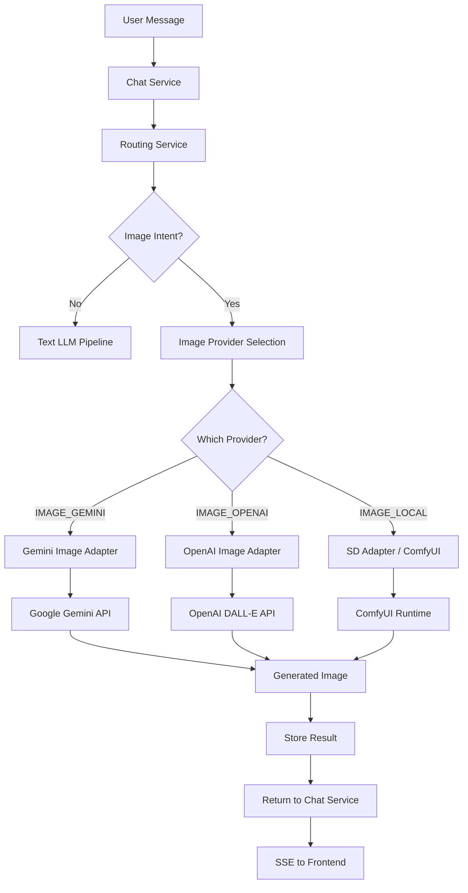
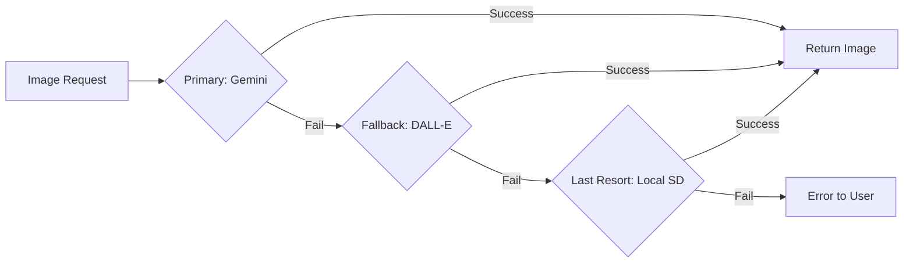

# Image Pipeline Architecture

## Overview

The image generation pipeline supports three providers: OpenAI DALL-E 3, Google Gemini 2.5 Flash Image, and local Stable Diffusion via ComfyUI. The routing engine detects image intent and dispatches to the appropriate provider through the image-service.

---

## Pipeline Architecture



---

## Intent Detection

The routing engine uses 90+ keywords to identify image generation requests:

### Detection Priority

Image generation detection has the **highest priority** in the routing pipeline. It is checked before any text-task classification:

```
1. Check IMAGE_KEYWORDS (90+ patterns)  -> IMAGE_GEMINI
2. Check FILE_GENERATION patterns       -> FILE_GENERATION
3. Check CODING_KEYWORDS (28 patterns)  -> ANTHROPIC
4. Check REASONING_KEYWORDS (21)        -> DEEPSEEK / local
5. ... other text classifications
```

### Keyword Categories

| Category | Count | Examples |
| --- | --- | --- |
| Direct creation | ~25 | "generate an image", "draw me", "create a picture" |
| Reference-based | ~20 | "similar to this", "recreate this image", "variation of" |
| Scene/location | ~12 | "fantasy map", "movie poster", "app icon" |
| Single-word indicators | ~10 | "render", "portrait", "illustration", "logo" |
| Strong phrases | ~25 | "make me a picture", "design a logo", "paint a" |

---

## Provider Adapters

### gemini-image.adapter.ts

- **Provider**: Google Gemini 2.5 Flash Image
- **Model**: `gemini-2.5-flash-image`
- **Capabilities**: Text-to-image, image editing, style transfer
- **API**: Google Generative AI API
- **Cost**: Per-request pricing

### openai-image.adapter.ts

- **Provider**: OpenAI DALL-E 3
- **Model**: `dall-e-3`
- **Capabilities**: Photorealistic images, creative art, text rendering
- **API**: OpenAI Images API
- **Cost**: Per-image pricing (varies by resolution)

### stable-diffusion.adapter.ts

- **Provider**: Local Stable Diffusion via ComfyUI
- **Model**: SDXL-Turbo, FLUX, SD 3.5 (configurable)
- **Capabilities**: Fast local generation, no internet required
- **API**: ComfyUI REST API
- **Cost**: Free (local compute only)

---

## Multi-Provider Fallback



Fallback triggers:
- API timeout
- Rate limiting (429)
- Server error (500/502/503)
- Content policy rejection
- ComfyUI not running (for local)

---

## Reference Image Support

Users can generate images based on existing reference images:

1. User uploads a reference image via file attachment
2. User sends: "Generate a variation of this in watercolor style"
3. Routing detects reference-based intent ("variation of this")
4. Reference image is retrieved from file-service
5. Image adapter sends both the text prompt and reference image to the provider
6. Provider generates a variation
7. Result is returned in the chat thread

### Reference Detection Keywords

`generate similar`, `similar to this`, `like this image`, `recreate this`, `reproduce this`, `same style as`, `based on this image`, `inspired by this`, `variation of this`, `generate from this`, `create from this`, `make one like this`, `remake this`, `redo this image`

---

## Data Model

### Image Service Database (claw_images)

```
ImageJob:
  id:              UUID
  userId:          UUID
  prompt:          String
  provider:        String (IMAGE_OPENAI, IMAGE_GEMINI, IMAGE_LOCAL)
  model:           String
  status:          Enum (PENDING, IN_PROGRESS, COMPLETED, FAILED)
  imageUrl:        String?
  dimensions:      String? (e.g., "1024x1024")
  error:           String?
  referenceFileId: UUID?
  metadata:        JSON
  createdAt:       DateTime
  updatedAt:       DateTime
```

---

## Events

| Event | Payload | Consumer |
| --- | --- | --- |
| `image.generated` | jobId, userId, provider, model, prompt | audit-service |
| `image.failed` | jobId, userId, provider, error | audit-service |

---

## Configuration

| Variable | Default | Description |
| --- | --- | --- |
| `STABLE_DIFFUSION_URL` | -- | Local SD/ComfyUI endpoint |
| `COMFYUI_BASE_URL` | -- | ComfyUI API base URL |
| `COMFYUI_PORT` | -- | ComfyUI port |
| `IMAGE_SERVICE_URL` | `http://image-service:4012` | Internal service URL |
| `IMAGE_PORT` | `4012` | Image service port |

---

## Nginx Configuration

The image service route in Nginx:

```nginx
location /api/v1/images {
    proxy_pass http://image-service:4012;
    proxy_http_version 1.1;
    proxy_set_header Host $host;
    proxy_set_header X-Real-IP $remote_addr;
    proxy_set_header X-Request-ID $request_id;
}
```

No special SSE configuration needed for image generation (uses standard request-response, not streaming).
