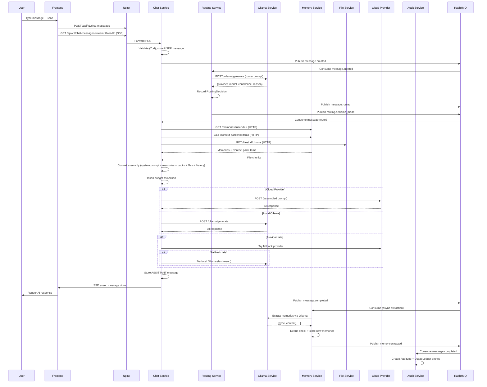

# Complete Message Flow

## Overview

This document traces the full lifecycle of a user message from the moment the user presses send to the final audit log entry. The flow involves 7 services, 3 communication patterns (HTTP, RabbitMQ, SSE), and multiple async post-processing pipelines.

---

## End-to-End Sequence



---

## Step-by-Step Details

### Step 1: User Sends Message

**Frontend** sends:

```
POST /api/v1/chat-messages
Authorization: Bearer <jwt>

{
  "threadId": "uuid",
  "content": "Explain the observer pattern",
  "provider": null,
  "model": null,
  "fileIds": [],
  "contextPackIds": []
}
```

Frontend also maintains an SSE connection:

```
GET /api/v1/chat-messages/stream/:threadId
Authorization: Bearer <jwt>
```

### Step 2: Chat Service Stores User Message

1. Zod validates the request body
2. Creates USER ChatMessage record in `claw_chat`
3. Creates MessageAttachment records for any fileIds
4. Publishes `message.created` event to RabbitMQ

### Step 3: Routing Service Determines Provider

1. Consumes `message.created`
2. Loads active routing policies (sorted by priority)
3. Determines routing mode (thread setting or policy override)
4. Executes routing strategy:
   - **AUTO**: Send to Ollama router (10s timeout), Zod-validate response, heuristic fallback
   - **MANUAL_MODEL**: Use forced provider/model
   - **LOCAL_ONLY**: Category-aware local model selection
   - **Other modes**: Mode-specific logic
5. Records RoutingDecision in `claw_routing`
6. Publishes `message.routed` with selectedProvider, selectedModel, confidence, fallback

### Step 4: Chat Service Assembles Context

ContextAssemblyManager orchestrates parallel data gathering:

1. **Memories** (HTTP GET to memory-service): Up to 20 enabled user memories
2. **Context pack items** (HTTP GET to memory-service): All items from attached packs
3. **File chunks** (HTTP GET to file-service): Chunks from attached files
4. **Thread history** (local DB query): Recent messages in chronological order

Prompt structure:

```
[System Prompt]          Thread.systemPrompt or default
[Memories]               User's enabled memories (max 20)
[Context Pack Items]     Sorted by sortOrder
[File Chunks]            Sorted by chunkIndex
[Thread History]         Previous messages
[Current User Message]   The new message
```

Token budget truncation: Keeps head (system prompt, memories, current message), drops from tail (oldest history).

### Step 5: Chat Service Executes LLM Call

ChatExecutionManager handles the fallback chain:

```
Primary (from routing) --> Fallback (from routing) --> Local Ollama --> Error
```

Fallback triggers: timeout, 429, 500/502/503, network failure, invalid response.

Response captured: content, inputTokens, outputTokens, latencyMs, actual provider/model.

### Step 6: Store Assistant Message

Creates ASSISTANT ChatMessage:

- content, provider, model, routingMode
- inputTokens, outputTokens, latencyMs
- metadata: routing decision details, fallback info

Updates thread: lastProvider, lastModel, updatedAt.

### Step 7: SSE Completion Event

```
event: message.done
data: {
  "messageId": "uuid",
  "threadId": "uuid",
  "content": "The observer pattern is...",
  "provider": "anthropic",
  "model": "claude-sonnet-4",
  "inputTokens": 1250,
  "outputTokens": 430,
  "latencyMs": 2340
}
```

### Step 8: Async Post-Processing

**Memory Extraction** (memory-service):

1. Receives `message.completed` event
2. Sends user message + AI response to Ollama extraction model
3. Ollama returns structured memories (Zod-validated)
4. Dedup check against existing user memories
5. Stores new MemoryRecords
6. Publishes `memory.extracted`

**Audit Logging** (audit-service):

1. Receives `message.completed` event
2. Creates AuditLog entry (action: MESSAGE_COMPLETED)
3. Creates UsageLedger entry (tokens consumed, provider, model)

---

## Error Handling Matrix

| Step | Error                   | Handling                                          |
| ---- | ----------------------- | ------------------------------------------------- |
| 1    | Network failure         | Frontend retry with exponential backoff           |
| 2    | DB error                | BusinessException, 500, no event published        |
| 3    | Ollama timeout          | Heuristic fallback (no delay beyond 10s)          |
| 3    | No healthy providers    | Return local-ollama, low confidence               |
| 4    | Memory service down     | Continue without memories, log warning            |
| 4    | File service down       | Continue without file chunks, log warning         |
| 5    | Primary provider fails  | Automatic fallback to secondary                   |
| 5    | Weak response detected  | Auto re-route to next candidate (max 2 attempts)  |
| 5    | All providers fail      | Store error as ASSISTANT message, SSE error event |
| 6    | DB error                | Log error, SSE error to frontend                  |
| 7    | SSE connection dropped  | Frontend reconnects, polls for missed messages    |
| 8    | Memory extraction fails | RabbitMQ retry (3x), then DLQ                     |
| 8    | Audit logging fails     | RabbitMQ retry (3x), then DLQ                     |

### Critical: All-Providers-Fail Handling

When all LLM providers fail, the system MUST:

1. Store an error message as an ASSISTANT record (with `metadata: { error: true }`)
2. Emit SSE error event so the frontend can react immediately
3. Without this, the frontend's polling ("AI is thinking...") runs forever

---

## Timing Expectations

| Phase                      | Typical Duration |
| -------------------------- | ---------------- |
| Frontend to Nginx          | < 5ms            |
| Nginx to chat-service      | < 5ms            |
| Store USER message         | 5-20ms           |
| RabbitMQ publish + consume | 10-50ms          |
| Routing decision (AUTO)    | 500ms - 10s      |
| Context assembly           | 50-200ms         |
| LLM execution (local)      | 1-30s            |
| LLM execution (cloud)      | 500ms - 60s      |
| Store ASSISTANT message    | 5-20ms           |
| SSE delivery               | < 5ms            |
| Memory extraction (async)  | 2-15s            |
| Audit logging (async)      | 5-20ms           |

**Total user-perceived latency**: Routing + LLM execution = typically 2-15 seconds.
