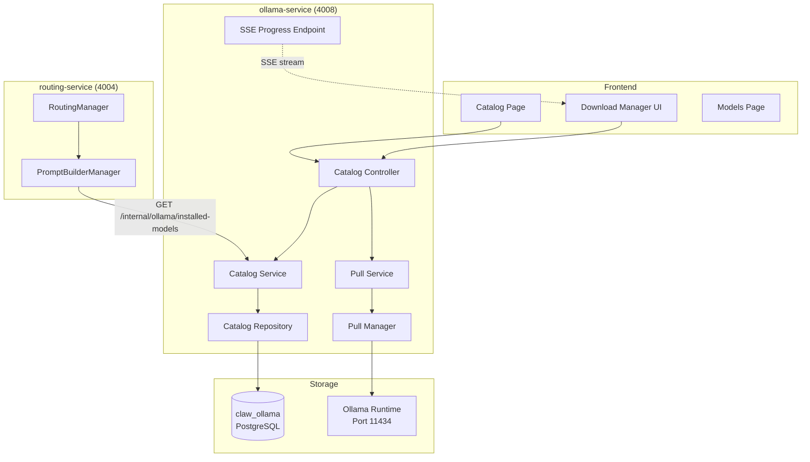
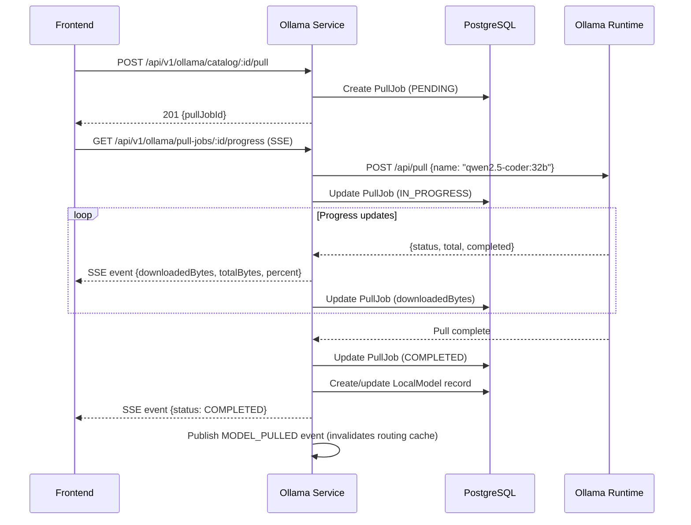

# Model Catalog Architecture

## Overview

The model catalog system enables users to browse, download, and manage local AI models. It integrates with the routing engine through dynamic prompt building that automatically adapts to installed models.

---

## System Components



---

## Data Flow: Browse Catalog

```
1. Frontend: GET /api/v1/ollama/catalog?category=CODING&page=1
2. Nginx: Forward to ollama-service:4008
3. CatalogController: Extract query params
4. CatalogService: Call repository with filters
5. CatalogRepository: Query ModelCatalogEntry table
6. Response: Paginated list of catalog entries with install status
```

Each catalog entry includes whether the model is already installed locally, enabling the UI to show "Installed" vs "Download" buttons.

---

## Data Flow: Download Model



---

## Dynamic Routing Integration

### PromptBuilderManager

The routing service builds its router prompt dynamically based on installed models:

1. **Fetch installed models**: HTTP GET to `/internal/ollama/installed-models`
2. **Group by category**: Organize models into coding, reasoning, thinking, etc.
3. **Build prompt sections**: List available models with their roles and capabilities
4. **Cache**: Prompt cached for 5 minutes (TTL from `PROMPT_CACHE_TTL_MS`)

### Cache Invalidation

The prompt cache is invalidated when:
- `MODEL_PULLED` event is received (new model installed)
- `MODEL_DELETED` event is received (model removed)
- TTL expires (5 minutes)

This ensures the routing prompt always reflects the current model inventory within a 5-minute window.

### Category-to-Role Mapping

```
Category         -> Role Enum              -> Routing Behavior
─────────────────────────────────────────────────────────────
coding           -> LOCAL_CODING           -> Used for code tasks in LOCAL_ONLY mode
reasoning        -> LOCAL_REASONING        -> Used for math/logic tasks
thinking         -> LOCAL_THINKING         -> Used for research/analysis tasks
chat             -> LOCAL_FALLBACK_CHAT    -> Default local model
image-generation -> LOCAL_IMAGE_GENERATION -> Local diffusion model
file-generation  -> LOCAL_FILE_GENERATION  -> Structured output for files
```

When a user is in LOCAL_ONLY mode and sends a coding question, the routing engine:
1. Detects coding keywords (28 patterns)
2. Maps to LOCAL_CODING role
3. Finds the model assigned to LOCAL_CODING
4. Routes to that model (e.g., qwen2.5-coder:14b)

If no model is assigned to the role, falls back to the default local model (gemma3:4b).

---

## Data Model

### ModelCatalogEntry

```
id:              UUID (auto-generated)
name:            String      "qwen2.5-coder"
tag:             String      "32b"
displayName:     String      "Qwen 2.5 Coder 32B"
category:        Enum        CODING | FILE_GENERATION | IMAGE_GENERATION | ROUTING | REASONING | THINKING
description:     String      "Best local coding model..."
sizeBytes:       BigInt      21474836480
parameterCount:  String      "32B"
runtime:         String      "OLLAMA" | "COMFYUI"
ollamaName:      String      "qwen2.5-coder:32b"
isRecommended:   Boolean     true
capabilities:    String[]    ["code_generation", "debugging"]
createdAt:       DateTime
updatedAt:       DateTime
```

### PullJob

```
id:              UUID
catalogEntryId:  UUID?       Reference to catalog entry (if pulled from catalog)
modelName:       String      "qwen2.5-coder:32b"
status:          Enum        PENDING | IN_PROGRESS | COMPLETED | FAILED
totalBytes:      BigInt?     Total download size
downloadedBytes: BigInt?     Current progress
error:           String?     Error message on failure
createdAt:       DateTime
updatedAt:       DateTime
```

### LocalModel

```
id:              UUID
name:            String      "qwen2.5-coder"
tag:             String      "32b"
runtime:         String      "OLLAMA"
family:          String?     "qwen"
parameters:      String?     "32B"
sizeBytes:       BigInt?     Model file size
createdAt:       DateTime
updatedAt:       DateTime
```

### LocalModelRoleAssignment

```
id:              UUID
modelId:         UUID        Reference to LocalModel
role:            Enum        ROUTER | LOCAL_FALLBACK_CHAT | LOCAL_CODING | LOCAL_REASONING | LOCAL_FILE_GENERATION | LOCAL_THINKING | LOCAL_IMAGE_GENERATION
isActive:        Boolean
createdAt:       DateTime
```

---

## Internal API (Not Exposed via Nginx)

| Endpoint | Method | Purpose |
| --- | --- | --- |
| `/internal/ollama/router-model` | GET | Get the currently assigned router model name |
| `/internal/ollama/installed-models` | GET | List all installed models with their role assignments |

These endpoints are `@Public()` (no JWT required) because they are called by internal services (routing-service) that do not carry user tokens for inter-service calls.

---

## Seed Process

The catalog is seeded from `apps/claw-ollama-service/prisma/seed-catalog.ts`:

```bash
cd apps/claw-ollama-service
npx tsx prisma/seed-catalog.ts
```

This creates 30 ModelCatalogEntry records. The seed is idempotent (uses upsert by name+tag).

---

## Auto-Pull on Startup

Configurable via `AUTO_PULL_MODELS` environment variable (space-separated list):

```
AUTO_PULL_MODELS=gemma3:4b llama3.2:3b phi3:mini gemma2:2b tinyllama
```

On Docker container startup, the ollama-service checks which models from this list are not yet installed and initiates pull jobs for them.
