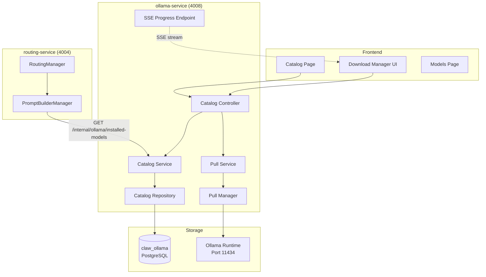
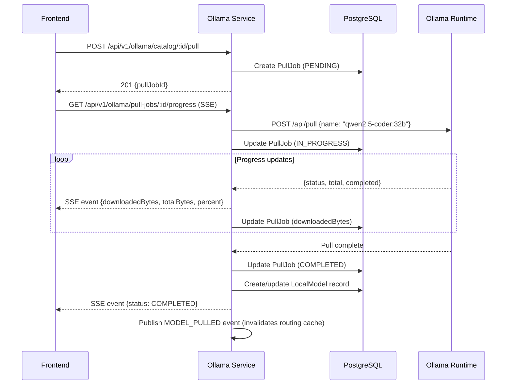

# Model Catalog Architecture

## Overview

The model catalog system enables users to browse, download, and manage **local**
AI models. It integrates with the routing engine through dynamic prompt building
that automatically adapts to installed models.

> **Scope warning.** This document is about the LOCAL catalog only —
> ollama-service and llama.cpp. It is not the catalog behind the chat model
> picker, and it is not where a cloud model comes from.
>
> | You are looking for                                | Go to                                                                                                                                                         |
> | -------------------------------------------------- | ------------------------------------------------------------------------------------------------------------------------------------------------------------- |
> | The models a user can pick in chat (cloud + local) | `ConnectorModel` in connector-service — [service-guide-connector](../04-backend/service-guide-connector.md)                                                   |
> | The models the public marketing pages list         | `/internal/connectors/public-catalog`, same guide                                                                                                             |
> | Per-model pricing                                  | `ModelCostVersion` in routing-service (integer micro-USD). The `inputUsdPerMillion` columns on `ConnectorModel` are written by one adapter and read by nobody |
> | Pulling and managing local models                  | this document                                                                                                                                                 |
>
> Reading this file as "the model catalog" is the mistake it keeps causing:
> connector-service is what fills the picker, and it is not mentioned below.

---

## System Components


```mermaid
graph TB
    subgraph Frontend
        CAT[Catalog Page]
        DL[Download Manager UI]
        MOD[Models Page]
    end

    subgraph "ollama-service (4008)"
        CC[Catalog Controller]
        CS[Catalog Service]
        CR[Catalog Repository]
        PS[Pull Service]
        PM[Pull Manager]
        SSE[SSE Progress Endpoint]
    end

    subgraph "routing-service (4004)"
        PB[PromptBuilderManager]
        RM[RoutingManager]
    end

    subgraph Storage
        DB[(claw_ollama<br/>PostgreSQL)]
        OLL[Ollama Runtime<br/>Port 11434]
    end

    CAT --> CC
    DL --> CC
    CC --> CS --> CR --> DB
    CC --> PS --> PM --> OLL
    SSE -.->|SSE stream| DL

    PB -->|GET /internal/ollama/installed-models| CS
    RM --> PB
```

---

## Data Flow: Browse Catalog

```
1. Frontend: GET /api/v1/ollama/catalog?category=CODING&page=1
2. Nginx: Forward to ollama-service:4008
3. CatalogController: Extract query params
4. CatalogService: Call repository with filters
5. CatalogRepository: Query ModelCatalogEntry table
6. Response: Paginated list of catalog entries with install status
```

Each catalog entry includes whether the model is already installed locally, enabling the UI to show "Installed" vs "Download" buttons.

---

## Data Flow: Download Model


```mermaid
sequenceDiagram
    participant FE as Frontend
    participant OS as Ollama Service
    participant DB as PostgreSQL
    participant OLL as Ollama Runtime

    FE->>OS: POST /api/v1/ollama/catalog/:id/pull
    OS->>DB: Create PullJob (PENDING)
    OS-->>FE: 201 {pullJobId}

    FE->>OS: GET /api/v1/ollama/pull-jobs/:id/progress (SSE)

    OS->>OLL: POST /api/pull {name: "qwen2.5-coder:32b"}
    OS->>DB: Update PullJob (IN_PROGRESS)

    loop Progress updates
        OLL-->>OS: {status, total, completed}
        OS-->>FE: SSE event {downloadedBytes, totalBytes, percent}
        OS->>DB: Update PullJob (downloadedBytes)
    end

    OLL-->>OS: Pull complete
    OS->>DB: Update PullJob (COMPLETED)
    OS->>DB: Create/update LocalModel record
    OS-->>FE: SSE event {status: COMPLETED}
    OS->>OS: Publish MODEL_PULLED event (invalidates routing cache)
```

---

## Dynamic Routing Integration

### PromptBuilderManager

The routing service builds its router prompt dynamically based on installed models:

1. **Fetch installed models**: HTTP GET to `/internal/ollama/installed-models`
2. **Group by category**: Organize models into coding, reasoning, thinking, etc.
3. **Build prompt sections**: List available models with their roles and capabilities
4. **Cache**: Prompt cached for 5 minutes (TTL from `PROMPT_CACHE_TTL_MS`)

### Cache Invalidation

The prompt cache is invalidated when:

- `MODEL_PULLED` event is received (new model installed)
- `MODEL_DELETED` event is received (model removed)
- TTL expires (5 minutes)

This ensures the routing prompt always reflects the current model inventory within a 5-minute window.

### Category-to-Role Mapping

```
Category         -> Role Enum              -> Routing Behavior
─────────────────────────────────────────────────────────────
coding           -> LOCAL_CODING           -> Used for code tasks in LOCAL_ONLY mode
reasoning        -> LOCAL_REASONING        -> Used for math/logic tasks
thinking         -> LOCAL_THINKING         -> Used for research/analysis tasks
chat             -> LOCAL_FALLBACK_CHAT    -> Default local model
image-generation -> LOCAL_IMAGE_GENERATION -> Local diffusion model
file-generation  -> LOCAL_FILE_GENERATION  -> Structured output for files
```

When a user is in LOCAL_ONLY mode and sends a coding question, the routing engine:

1. Detects coding keywords (28 patterns)
2. Maps to LOCAL_CODING role
3. Finds the model assigned to LOCAL_CODING
4. Routes to that model (e.g., qwen2.5-coder:14b)

If no model is assigned to the role, falls back to the default local model (gemma3:4b).

---

## Data Model

### ModelCatalogEntry

```
id:              UUID (auto-generated)
name:            String      "qwen2.5-coder"
tag:             String      "32b"
displayName:     String      "Qwen 2.5 Coder 32B"
category:        Enum        CODING | FILE_GENERATION | IMAGE_GENERATION | ROUTING | REASONING | THINKING
description:     String      "Best local coding model..."
sizeBytes:       BigInt      21474836480
parameterCount:  String      "32B"
runtime:         String      "OLLAMA" | "COMFYUI"
ollamaName:      String      "qwen2.5-coder:32b"
isRecommended:   Boolean     true
capabilities:    String[]    ["code_generation", "debugging"]
createdAt:       DateTime
updatedAt:       DateTime
```

### PullJob

```
id:              UUID
catalogEntryId:  UUID?       Reference to catalog entry (if pulled from catalog)
modelName:       String      "qwen2.5-coder:32b"
status:          Enum        PENDING | IN_PROGRESS | COMPLETED | FAILED
totalBytes:      BigInt?     Total download size
downloadedBytes: BigInt?     Current progress
error:           String?     Error message on failure
createdAt:       DateTime
updatedAt:       DateTime
```

### LocalModel

```
id:              UUID
name:            String      "qwen2.5-coder"
tag:             String      "32b"
runtime:         String      "OLLAMA"
family:          String?     "qwen"
parameters:      String?     "32B"
sizeBytes:       BigInt?     Model file size
createdAt:       DateTime
updatedAt:       DateTime
```

### LocalModelRoleAssignment

```
id:              UUID
modelId:         UUID        Reference to LocalModel
role:            Enum        ROUTER | LOCAL_FALLBACK_CHAT | LOCAL_CODING | LOCAL_REASONING | LOCAL_FILE_GENERATION | LOCAL_THINKING | LOCAL_IMAGE_GENERATION
isActive:        Boolean
createdAt:       DateTime
```

---

## Internal API (Not Exposed via Nginx)

| Endpoint                            | Method | Purpose                                               |
| ----------------------------------- | ------ | ----------------------------------------------------- |
| `/internal/ollama/router-model`     | GET    | Get the currently assigned router model name          |
| `/internal/ollama/installed-models` | GET    | List all installed models with their role assignments |

These endpoints are `@Public()` (no JWT required) because they are called by internal services (routing-service) that do not carry user tokens for inter-service calls.

---

## Seed Process

The catalog is seeded from `apps/claw-ollama-service/prisma/seed-catalog.ts`:

```bash
cd apps/claw-ollama-service
npx tsx prisma/seed-catalog.ts
```

This creates **170** `ModelCatalogEntry` records — the length of `CATALOG_ENTRIES`
in `src/modules/ollama/constants/catalog-entries.constants.ts`, which the seed
imports rather than defining inline. (Verified 2026-09-12; it said 30 for a long
time after the list grew.)

The seed is idempotent, by `upsert` on the compound key **`(name, tag, runtime)`**
— not `name+tag`. `runtime` is part of it because the same model name can exist
for OLLAMA and for LLAMACPP and they are different rows.

It also opens with a **targeted** `deleteMany`, scoped to
`DEPRECATED_DEFAULT_LOCAL_MODEL_KEYS`, and skips those same keys in the upsert
loop. That is a purge of models the product no longer ships as defaults, not a
wipe-and-reload — the rest of the table is left alone.

---

## Auto-Pull on Startup

Configurable via the `AUTO_PULL_MODELS` environment variable (space-separated):

```
AUTO_PULL_MODELS=qwen3:1.7b
```

**It is the `claw-ollama` CONTAINER that does this, not ollama-service.** The
loop is an inline shell entrypoint in
`docker/docker-compose.{dev,prod}.ollama.yml`; no application code reads
`AUTO_PULL_MODELS`, and no `PullJob` row is created. Looking for it in
`apps/claw-ollama-service` finds nothing, which reads as "this feature does not
exist" — it does.

It waits for `ollama list` to answer, then pulls anything in the list that is
not already present. The default when the variable is unset is `qwen3:1.7b`.

**Do not copy an example that names a deprecated model.** This document
previously suggested `gemma3:4b llama3.2:3b phi3:mini gemma2:2b tinyllama` —
which is now, exactly, the `DEPRECATED_MODELS` list the same entrypoint script
REMOVES a few lines later. Following it made the container pull five models and
then delete them on the next boot.

---

## Unauthenticated inference routes (verify before trusting)

`OllamaController` marks three routes `@Public()`:

- `POST /api/v1/ollama/generate`
- `POST /api/v1/ollama/chat`
- `GET /api/v1/ollama/health`

and `infra/nginx/locations.conf` proxies `location /api/v1/ollama` to the
service. Read together, that means **inference with no authentication, reachable
from the internet**, on a deployment where the service is running and the port
is published.

This is recorded rather than fixed because changing it is a product decision:
something may depend on the open route, and the fix (a guard, or dropping the
nginx location) breaks that caller loudly.

**Status: not confirmed live.** On this deployment `claw-ollama-service` has been
stopped for 32 hours, so the request returns 502 from nginx rather than an
answer — a 502 here proves nothing about whether the route is protected. Anyone
picking this up should start the service and re-check before deciding how urgent
it is.

Doc note: the internal-API section above correctly says `/internal/ollama` is not
exposed via nginx. That is true, and it is not the exposure that matters here.
