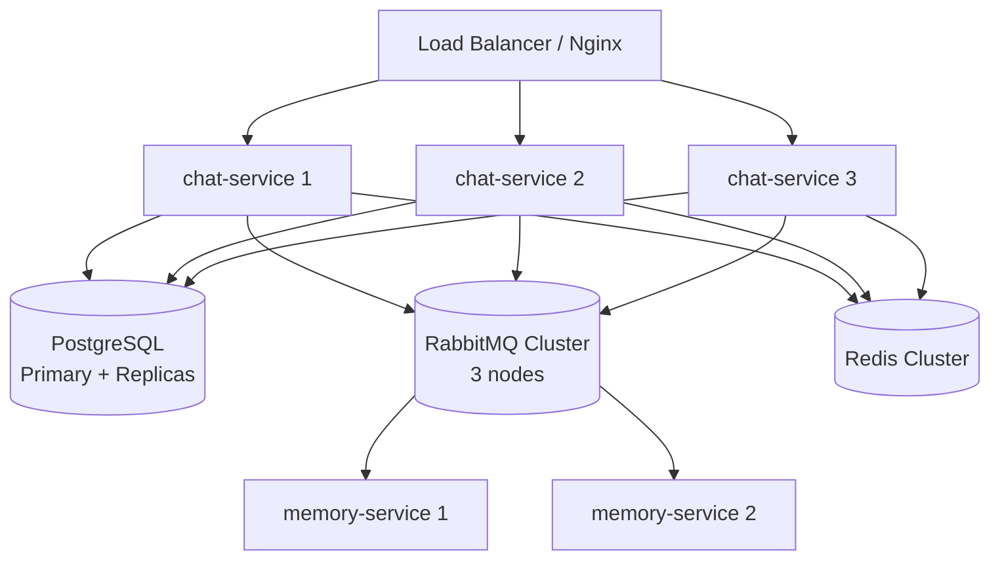

# Scaling Considerations

## Overview

ClawAI is designed as stateless microservices that can be horizontally scaled. This document covers current scaling posture, bottleneck analysis, and the path to production-grade scalability.

---

## Current State (Development)

All 13 services run as single Docker containers on one machine (~22 containers total). This is sufficient for small teams (5-20 users) but has clear limits.

---

## Stateless Service Design

Most services are stateless and can be scaled horizontally:

| Service | Stateless? | State Location | Scaling Notes |
| --- | --- | --- | --- |
| auth-service | Yes | Sessions in PG | Multiple instances behind load balancer |
| chat-service | Mostly | SSE connections | Needs sticky sessions or Redis pub/sub for SSE |
| connector-service | Yes | Config in PG | Multiple instances |
| routing-service | Yes | Prompt cache in memory | Cache rebuild on each instance (5min TTL) |
| memory-service | Yes | Data in PG | Multiple instances |
| file-service | Yes | Files on disk/PG | Shared storage (NFS/S3) needed |
| audit-service | Yes | Data in MongoDB | Multiple instances |
| ollama-service | Yes* | Models in Ollama | Ollama itself is stateful (GPU memory) |
| health-service | Yes | No database | Multiple instances |
| client-logs-service | Yes | Data in MongoDB | Multiple instances |
| server-logs-service | Yes | Data in MongoDB | Multiple instances |
| image-service | Yes | Data in PG | Multiple instances, but ComfyUI is stateful |
| file-gen-service | Yes | Data in PG | Multiple instances |

---

## Horizontal Scaling Architecture



### SSE Scaling Challenge

Chat-service maintains SSE connections. When scaled horizontally:

**Problem**: User connects to instance 1, but the AI response is processed by instance 2. Instance 2 cannot send the SSE event to the user.

**Solutions**:
1. **Sticky sessions**: Nginx `ip_hash` or cookie-based session affinity ensures each user connects to the same instance.
2. **Redis Pub/Sub**: All instances subscribe to a Redis channel. When any instance has a response, it publishes to Redis, and the instance holding the SSE connection delivers it.
3. **Move SSE to a dedicated service**: A lightweight SSE gateway that subscribes to Redis/RabbitMQ for all response events.

---

## Database Scaling

### PostgreSQL

| Strategy | When to Use | Implementation |
| --- | --- | --- |
| Read replicas | Read-heavy services (chat, memory) | PostgreSQL streaming replication |
| Connection pooling | High concurrency | PgBouncer in front of each database |
| Vertical scaling | Before horizontal | Larger instance (more CPU, memory) |
| Partitioning | Very large tables | Table partitioning by date (chat messages) |

**Connection Pooling (PgBouncer)**:
- Prisma default pool: 5 connections per service
- With PgBouncer: 100+ concurrent connections multiplexed over fewer DB connections
- Critical before scaling services horizontally (each instance opens its own pool)

### MongoDB

| Strategy | When to Use | Implementation |
| --- | --- | --- |
| Replica sets | High availability | 3-node replica set |
| Sharding | Very high volume | Shard by userId for audit, by serviceName for logs |
| TTL optimization | Storage management | Already implemented (30-day TTL on logs) |

### Redis

| Strategy | When to Use | Implementation |
| --- | --- | --- |
| Redis Sentinel | High availability | 3 Sentinel nodes monitoring primary |
| Redis Cluster | High throughput | Sharded across multiple nodes |

---

## Message Bus Scaling

### RabbitMQ Cluster

For production:
- **3-node cluster** minimum
- **Quorum queues** for durability (replace classic mirrored queues)
- **Publisher confirms** for guaranteed delivery (already implemented)
- **Consumer prefetch** tuning (prevent one consumer from monopolizing messages)

### Consumer Scaling

RabbitMQ supports competing consumers. Multiple instances of the same service share a queue:

```
routing.queue --> routing-service-1 (round-robin)
             --> routing-service-2
             --> routing-service-3
```

Each message is delivered to exactly one consumer. This provides natural horizontal scaling for event processing.

---

## Bottleneck Analysis

| Component | Bottleneck | Impact | Mitigation |
| --- | --- | --- | --- |
| **Ollama** | GPU memory, single instance | Routing delays, generation queues | Multiple Ollama instances, request queuing, model hot-swapping |
| **Chat SSE** | Connection count per instance | Users cannot receive responses | Sticky sessions, Redis Pub/Sub |
| **Context Assembly** | N+1 HTTP calls | Latency per message | Batch endpoints, parallel calls, Redis caching |
| **Memory Extraction** | Ollama inference load | Extraction backlog | Dedicated Ollama instance, batch processing |
| **File Chunking** | CPU-bound for large files | Upload processing delay | Async processing, file size limits |
| **RabbitMQ** | Message throughput | Event processing delays | Clustering, prefetch tuning, consumer scaling |
| **PostgreSQL** | Connection limits | Write contention | PgBouncer, read replicas |

---

## Scaling Tiers

### Tier 1: Small Team (5-20 users)

Current Docker Compose deployment. Single instance of everything.
- Expected message volume: < 1,000/day
- Infrastructure: 1 machine, 32GB RAM, optional GPU

### Tier 2: Department (20-100 users)

Key changes:
- PgBouncer for connection pooling
- Redis Sentinel for HA
- RabbitMQ 3-node cluster
- 2-3 instances of chat-service (with sticky sessions)
- Dedicated Ollama instance for background tasks (memory extraction)
- Docker Compose with `deploy.replicas` or Docker Swarm

### Tier 3: Organization (100-1,000 users)

Key changes:
- Kubernetes deployment
- Managed PostgreSQL (RDS, Cloud SQL)
- Managed MongoDB (Atlas)
- Managed Redis (ElastiCache, Memorystore)
- Horizontal pod autoscaling for all services
- Multiple GPU nodes for Ollama
- CDN for static frontend assets
- External load balancer (ALB, GCP LB)

---

## Production Readiness Checklist

| Item | Status | Priority |
| --- | --- | --- |
| Automated backups (pg_dump, mongodump) | Not done | Critical |
| Database connection pooling (PgBouncer) | Not done | High |
| RabbitMQ clustering | Not done | High |
| Redis HA (Sentinel/Cluster) | Not done | High |
| Graceful shutdown handlers | Not done | Medium |
| Health check-based restart policies | Partial | Medium |
| Docker log rotation | Not done | Low |
| Horizontal scaling (multiple instances) | Architecture ready | Medium |
| Kubernetes manifests | Not done | Medium |
| Monitoring and alerting (Prometheus/Grafana) | Not done | High |
