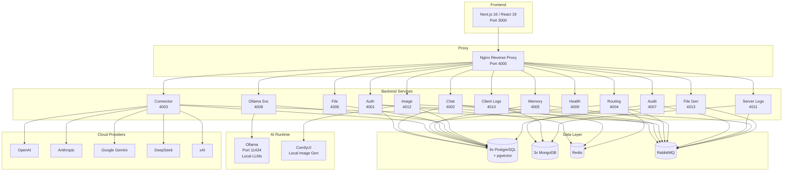

# System Overview

## What ClawAI Is

ClawAI is a local-first AI orchestration platform built as a distributed microservices system. It provides a single interface to multiple AI providers (OpenAI, Anthropic, Google Gemini, DeepSeek, xAI, and local Ollama), with intelligent routing that automatically selects the best model for each task based on content analysis, privacy requirements, and cost constraints.

---

## Architecture at a Glance



---

## 13 Backend Services

| # | Service | Port | Database | Purpose |
| --- | --- | --- | --- | --- |
| 1 | auth-service | 4001 | PG `claw_auth` | JWT authentication, RBAC, user management, sessions |
| 2 | chat-service | 4002 | PG `claw_chat` | Threads, messages, context assembly, LLM execution, SSE |
| 3 | connector-service | 4003 | PG `claw_connectors` | Cloud provider management, API key encryption, health checks, model sync |
| 4 | routing-service | 4004 | PG `claw_routing` | Intelligent routing (7 modes), policies, decision recording |
| 5 | memory-service | 4005 | PG `claw_memory` (pgvector) | Memory extraction, CRUD, context packs, semantic dedup |
| 6 | file-service | 4006 | PG `claw_files` | File upload, chunking (JSON/CSV/MD/text) |
| 7 | audit-service | 4007 | MongoDB `claw_audit` | 10 audit events, usage ledger |
| 8 | ollama-service | 4008 | PG `claw_ollama` | Local model management, catalog (30 models), pull jobs, generation proxy |
| 9 | health-service | 4009 | None | Aggregates health from all services |
| 10 | client-logs-service | 4010 | MongoDB `claw_client_logs` | Frontend log ingestion (TTL 30d) |
| 11 | server-logs-service | 4011 | MongoDB `claw_server_logs` | Backend log aggregation (TTL 30d) |
| 12 | image-service | 4012 | PG `claw_images` | Image generation (DALL-E, Gemini, SD) |
| 13 | file-generation-service | 4013 | PG `claw_file_generations` | File export (PDF/DOCX/CSV/HTML/MD/TXT/JSON) |

---

## Database Topology

### PostgreSQL (9 Databases)

Each service owns its database exclusively. No cross-database queries.

| Database | Service | Key Tables | Extensions |
| --- | --- | --- | --- |
| claw_auth | auth-service | User, Session, SystemSetting | -- |
| claw_chat | chat-service | ChatThread, ChatMessage, MessageAttachment | -- |
| claw_connectors | connector-service | Connector, ConnectorModel, ConnectorHealthEvent, ModelSyncRun | -- |
| claw_routing | routing-service | RoutingDecision, RoutingPolicy | -- |
| claw_memory | memory-service | MemoryRecord, ContextPack, ContextPackItem | pgvector |
| claw_files | file-service | File, FileChunk | -- |
| claw_ollama | ollama-service | LocalModel, LocalModelRoleAssignment, PullJob, RuntimeConfig, ModelCatalogEntry | -- |
| claw_images | image-service | ImageJob, GeneratedImage | -- |
| claw_file_generations | file-generation-service | FileGenerationJob | -- |

### MongoDB (3 Databases)

| Database | Service | Collections | TTL |
| --- | --- | --- | --- |
| claw_audit | audit-service | AuditLog, UsageLedger | None (retained indefinitely) |
| claw_client_logs | client-logs-service | ClientLog | 30 days |
| claw_server_logs | server-logs-service | ServerLog | 30 days |

### Redis

- Session caching
- Rate limiting state
- Ephemeral caching (routing prompt cache)

### RabbitMQ

- Single topic exchange: `claw.events` (durable)
- Dead-letter exchange: `claw.events.dlx`
- 3 retries with exponential backoff (1s, 5s, 30s)
- Per-service DLQ queues

---

## Communication Patterns

### Synchronous HTTP

Used when the caller needs an immediate response:
- chat-service -> memory-service (fetch memories for context)
- chat-service -> file-service (fetch file chunks)
- chat-service -> ollama-service (generate completion)
- chat-service -> connector-service (cloud provider API call)
- routing-service -> ollama-service (router model inference)
- health-service -> all services (health aggregation)

### Asynchronous RabbitMQ

Used for fire-and-forget operations:
- `message.created`: chat -> routing
- `message.routed`: routing -> chat
- `message.completed`: chat -> memory, audit
- `user.login/logout`: auth -> audit
- `connector.*`: connector -> audit, routing
- `log.server`: all -> server-logs

### Server-Sent Events (SSE)

Used for real-time streaming:
- chat-service -> frontend (AI response delivery)
- ollama-service -> frontend (model download progress)

---

## Technology Stack

| Layer | Technology | Version |
| --- | --- | --- |
| Frontend | Next.js, React, TanStack Query, Zustand, Tailwind, shadcn/ui | 16, 19, 5, 4, 3.4 |
| Backend | NestJS, TypeScript | 10.4, 5.6+ |
| ORM | Prisma (SQL), Mongoose (MongoDB) | 5.22 |
| Validation | Zod | 3.24 |
| Message Broker | RabbitMQ | 3.13+ |
| SQL Database | PostgreSQL + pgvector | 16+ |
| Document Database | MongoDB | 7+ |
| Cache | Redis | 7+ |
| Local AI | Ollama | Latest |
| Reverse Proxy | Nginx | 1.25+ |
| Containers | Docker, Docker Compose | 24+, 2.24+ |
| CI/CD | GitHub Actions | -- |
| Testing | Jest (backend), Vitest (frontend), Playwright (E2E) | -- |
| Linting | ESLint 9, Prettier | 9, 3.8 |

---

## Deployment

### Development

Single Docker Compose file (`docker-compose.dev.yml`): ~22 containers including all services, databases, message broker, cache, and AI runtime.

```bash
docker compose -f docker-compose.dev.yml up -d
```

### Production

Separate compose files for production optimization:
- `docker-compose.yml` (production)
- `docker-compose.dev.ollama.yml` (dev with Ollama)
- `docker-compose.prod.ollama.yml` (prod with Ollama)

All services use `env_file: .env` from root. Single `.env` file for all configuration.
